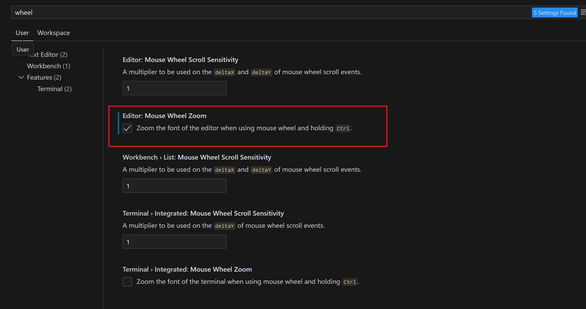

# 前言

最近cursor总犯病，每次都莫名其妙就说cursor.exe已经移动，是否删除快捷方式，搞得我每次都要重新安装。但是我之前的配置又必须重修搞过了，于是在此记录一下。


# 通用配置

鼠标找到`File -> Preferences -> VS Code Settings`。


打开后直接搜索`wheel`，然后勾上方框这个选项。这个作用是可以按住Ctrl+滚轮调整代码大小。




# jsp

jsp主要是配置代码模板，不然敲起来太麻烦了。

找到`File -> Preferences -> Configure Snippets`


打开后点击`New Global Snippets file...`，然后输入`jsp.json`。我这里是因为已经创建过了所以会显示出来，重装后就没了，要重修创建代码模板。


然后将下列这段json代码完整地替换原先的东西。

```json
{
	"JSP Template": {
		"prefix": "jsp",
		"body": [
			"<%@ page contentType=\"text/html;charset=UTF-8\" language=\"java\" %>",
			"<!DOCTYPE html>",
			"<html lang=\"en\">",
			"<head>",
			"    <meta charset=\"UTF-8\">",
			"    <title>${1:Document}</title>",
			"</head>",
			"<body>",
			"    ",
			"</body>",
			"</html>"
		],
		"description": "Create a JSP file with basic structure and cursor on the title"
	},
	"JSP Scriptlet": {
		"prefix": "java",
		"body": [
			"<% ",
			"\t$0",
			"%>"
		],
		"description": "JSP Scriptlet"
	},
	"JSP Declaration": {
		"prefix": "decl",
		"body": [
			"<%! ",
			"\t$0",
			"%>"
		],
		"description": "JSP Declaration"
	},
	"JSP Expression": {
		"prefix": "expr",
		"body": [
			"<%= $0 %>"
		],
		"description": "JSP Expression"
	},
	"JSP Import": {
		"prefix": "import",
		"body": [
			"<%@ page import=\"$0\" %>"
		],
		"description": "JSP Import"
	}
}
```

`jsp`呼出jsp的页面框架，作用和HTML的`!`一样。

`java`创建java程序片。

`decl`创建定义函数、类、变量的语句。

`expr`创建java表达式。

`import`创建导包语句。