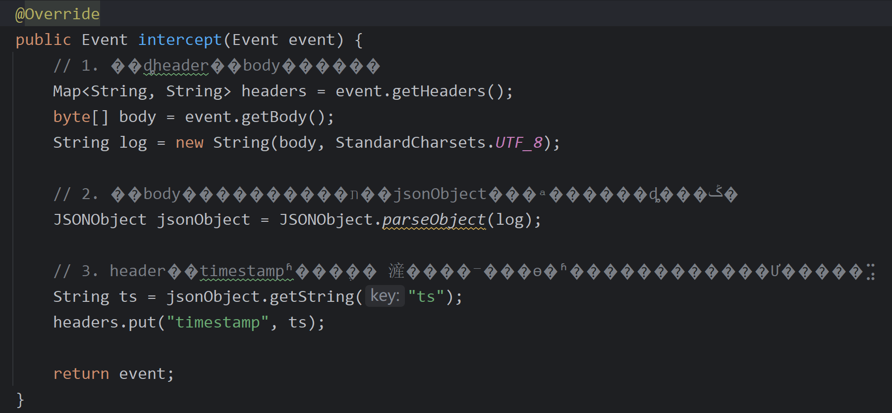
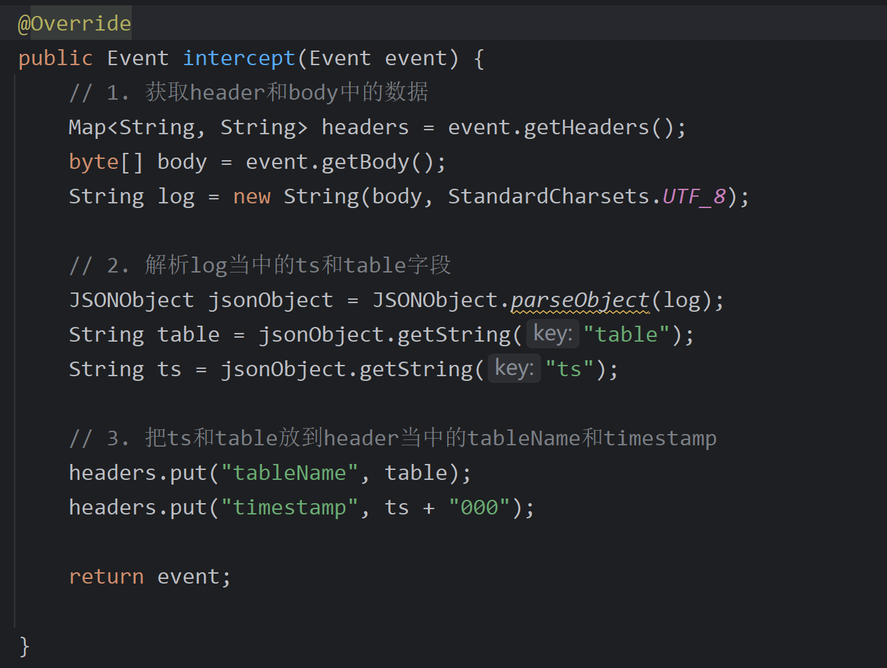

当我们用IDEA打开项目文件后，有很大概率会发现中文乱码了。这是因为文件本身是用UTF-8编码的，但是Windows默认采用GBK格式编码，故造成乱码。

这时我们需要进行两步操作，注意千万不能点错了，不然乱码的中文就再也变不回去了。

1. 右下角切换编码成GBK时，选择`reload`。
2. reload成GBK后就能发现中文正常显示了，不再乱码。此时同样在右下角切换编码为UTF-8，但是要选择`convert`。

这两步操作完成后就🆗了。

如果第一步选了convert，那么中文就再也变不回去了，就像我一样。。

但是正确操作后就没问题。

这个问题就这么愉快的解决了。