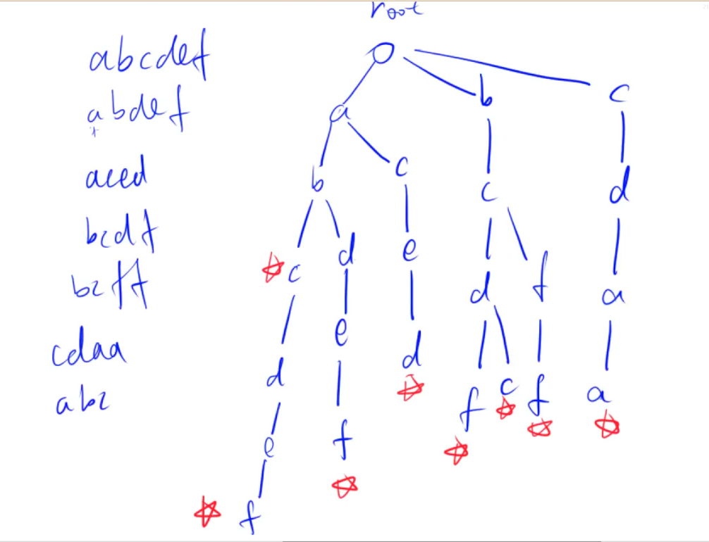
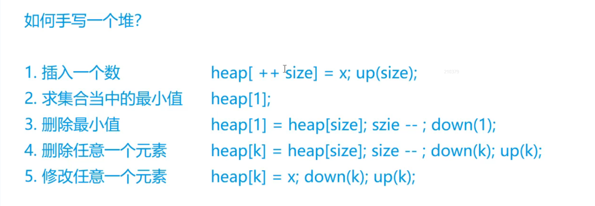

# 关于输入输出

我们知道，C语言的输入输出是最快的，而C++很慢，C语言的输入输出会比C++快10倍，所以oi选手基本上都是用C语言。但是我们也可以用C++，只需要在读入前添加两行代码就行：

```c++
cin.tie(0);
ios::sync_with_stdio(false);
```


# 基础算法

## 快速幂

```c++
//一般需要用到快速幂的地方，指数都会非常大，同时需要进行取模运算
//故为了防止爆掉应该开long long，所以干脆把所有的变量都开long long，这时如果a,b,p都是int就一定
//不会爆

//求完结果再取模和每一步运算都取模是一样的（b右移就不用了）
//若a和b都是long long，那么它还是会爆，这时候就需要写个快速乘来算ans了，将注释去掉，然后把
// ans = (ans * a) % p; 改成 ans = quick_mul(ans, a, p);
//再把a = (a * a) % p; 改成 a = quick_mul(a, a, p);
//当加法都爆了那就没办法了，不过一般不会这样
//快速乘与快速幂同理

#include <iostream>
using namespace std;

long long quick_power(long long a, long long b, long long p);
//long long quick_mul(long long a, long long b, long long p);

int main()
{
	long long a, b, p;
	cin >> a >> b >> p;
	long long ans = quick_power(a, b, p);
	cout << ans << endl;

	system("pause");

	return 0;
}

long long quick_power(long long a, long long b, long long p)
{
	long long ans = 1;
	while (b)
	{
		if (b & 1) ans = (ans * a) % p;
		b >>= 1;
		a = (a * a) % p;
	}
	return ans;
}

//long long quick_mul(long long a, long long b, long long p)
//{
//	long long ans = 0;
//	while (b)
//	{
//		if (b & 1) ans = (ans + a) % p;
//		b >>= 1;
//		a = (a + a) % p;
//	}
//	return ans;
//}
```


## 排序

### 快速排序

快速排序是从大往小排，每一层都将左右两半的序列各自排好序，然后进入下一层如此往复，最后会因为整个序列只有一个元素而返回，因为一个元素不需要排序，所以此时也说明整个序列都排好序了。因为从大到小排嘛，最小的部分（子序列）都排好了，说明整个待排序序列都排好序了。

```c++
#include <iostream>
using namespace std;

const int N = 100010;

int n;
int q[N];

void quick_sort(int q[], int l, int r)
{
    if (l >= r) return; // 左边界等于右边界则说明此时只有一个数了，不需要排序；如果左边界大于右边界，更应该停止了，因为这种情况不可能发生。
    int x = q[l + r >> 1], i = l - 1, j = r + 1; // x是哨兵，最好取中间，i和j分别是指针，用来交换两个元素以完成排序
    while (i < j) // 两个指针之间起码有两个不同的元素，这样才能交换，左右交换
    {
        while (q[++i] < x); // 因为是从小到大排序，所以最终的序列要满足哨兵左边小于等于哨兵，哨兵右边大于等于哨兵
        while (q[--j] > x); // 所以只有左边大于哨兵和右边小于哨兵的情况才需要交换
        if (i < j) swap(q[i], q[j]); // 这里还需要再判断此指针之间是否起码有两个元素，因为经过两个while循环，i和j可能变的不满足了
    }
    quick_sort(q, l, j); // 递归处理左右子序列，因为每一层都会将左右两部分序列排好序，所以最后只有一个元素而退出时，就说明整个序列都排好序了
    quick_sort(q, j + 1, r);
}

int main()
{
    cin >> n;
    for (int i = 0; i < n; i++) cin >> q[i];
    
    quick_sort(q, 0, n - 1); // 对下标为0到下标为n-1之间的数排序
    
    for (int i = 0; i < n; i++) cout << q[i] << ' ';
    
    return 0;
}
```

最好情况下的时间复杂度为 $O(nlogn)$，因为最好情况下每次都选中间的数作为哨兵，这样一直分下去就是要分 $logn$ 次，然后每个部分都要进行 $n$ 次的排序，因为虽然每一个部分没有 $n$ 个数，但是实际上每一层中所有元素都在各自的部分进行了排序，一共是 $n$ 次排序，所以最好情况下时间复杂度为 $O(nlogn)$。

最坏情况下的时间复杂度为 $O(n^2)$，因为最坏情况下每次都选边界的数作为哨兵，这样一直分下去就要分$n$次，因为每次分都只分了一个数出去，一共$n$个数就要分$n$次。然后每一层还是要进行$n$次排序，所以最坏情况下的时间复杂度会退化为 $O(n^2)$。

平均情况下的时间复杂度为 $O(nlogn)$。证明就算了，这是基于概率算出的结果。


还有一种证明方法是通过时间复杂性函数证明。

最好情况下每次所取的哨兵都是中间的数，则时间复杂性函数 $T(n)$ 为：
$$
T(n)=\left\{\begin{matrix} 
  O(1)  && {n\le1} \\  
  T(n/2)+O(n) && {n > 1}
\end{matrix}\right.
$$
求解该递归方程，再由时间渐近表达式的知识可得 $T(n)=O(n^2)$。


最坏情况下每次所取的哨兵都是最边缘的数，将产生的两个区域分别包含 $n-1$ 和 $1$ 个元素，则时间复杂性函数 $T(n)$ 为：
$$
T(n)=\left\{\begin{matrix} 
  O(1)  && {n\le1} \\  
  2T(n-1)+O(n) && {n > 1}
\end{matrix}\right.
$$
求解该递归方程，再由时间渐近表达式的知识可得 $T(n)=O(nlogn)$。


再提一嘴空间复杂度。快速排序是一种原地排序算法，辅助空间复杂度为 $O(1)$，但是它的递归，会使用系统的栈，而且递归深度在 $logn$ 到 $n$ 之间，所以空间复杂度不确定，在 $O(logn)$ 到 $O(n)$ 之间。

### 归并排序

归并排序是从小往大排，和快速排序完全相反，一开局的就左右一直递归二分直至将每个部分的数组的元素都变为1个，然后再排序、归并。因为只有一个元素时，排序就是直接比较这两个元素的大小了，小的放进临时数组，大的放后面，这样临时数组就已经是有序的了，然后再覆盖原数组，接着回到倒数第二层，且该部分已经排好了序。如此往复，上面每一层都借助已经排好了序的子序列部分数组而完成排序，一直返回到上面，直到返回到第一层完成排序+归并的步骤后，整个序列就都排好了序。

```c++
#include <iostream>
using namespace std;

const int N = 100010;

int n;
int q[N], tmp[N];

void merge_sort(int q[], int l, int r)
{
    if (l >= r) return; // 左右边界之间只有一个数则不需要排序，左边界大于右边界是不可能的情况，直接退出
    
    int mid = l + r >> 1; // 从中间分割为两部分
    merge_sort(q, l, mid); // 再对左右两部分分别递归分割，直至分到每个小部分都只有一个元素为止
    merge_sort(q, mid + 1, r);
    
    int i = l, j = mid + 1, k = 0; // 然后从每个部分都只有一个元素开始排序，然后将排好序的数组覆盖原数组（归并的过程），故要借助中间数组
    while (i <= mid && j <= r) // 两个部分都没到边界，则按从小到大排序，将各自小的数放到tmp数组中
    {
        if (q[i] <= q[j]) tmp[k++] = q[i++];
        else tmp[k++] = q[j++];
    }
    
    while (i <= mid) tmp[k++] = q[i++]; // 收尾，左右部分可能不一样长。因为归并是从1个元素的部分开始的，所以到这里的时候两个部分各自都是从小到大有序排列的，所以剩余的部分一定是最大的，直接按顺序放到tmp后面就行
    while (j <= r) tmp[k++] = q[j++];
    
    for (int i = l, k = 0; i <= r; i++, k++) q[i] = tmp[k]; // 归并，将排序好的临时数组覆盖原数组，这样这部分就是有序的了，再返回上一层继续排序+归并，这样第一层结束后整个数组就都排好序了
}

int main()
{
    cin >> n;
    for (int i = 0; i < n; i++) cin >> q[i];
    
    merge_sort(q, 0, n - 1); // 对元素下标为0到n-1的数进行归并排序
    
    for (int i = 0; i < n; i++) cout << q[i] << ' ';
    
    return 0;
}
```

对于归并排序，由于算法策略就是确定地将数组分成大致相同的两部分，所以实际上没有最好、最坏和平均的情况，都是同一种情况，即尽量将序列分为相等的两部分。这种划分方式一共会划分 $logn$ 次，每次排序和合并的时间开销是 $O(n)$，于是时间复杂度均为 $O(nlogn)$。

方法二也是通过时间复杂性函数证明。归并排序的时间复杂性函数为：
$$
T(n)=\left\{\begin{matrix} 
  O(1)  && {n\le1} \\  
  2T(n/2)+O(n) && {n > 1}
\end{matrix}\right.
$$
求解该递归方程，再由时间渐近表达式的知识可得 $T(n)=O(nlogn)$。


其空间复杂度为 $O(n)$，因为辅助数组的容量为 $n$。它的递归过程也使用了系统栈，但是由于最大只用了 $O(logn)$，所以整体空间复杂度还是 $O(n)$。

### 冒泡排序

```c++
/*实际上冒泡排序的代码很短，做题时可以直接写在主函数内，没必要增加代码长度*/
#include <iostream>
using namespace std;

int q[1000010];
void bubble_sort(int q[], int len);
int cnt = 0;

int main()
{
	int n;
	cin >> n;
	int i;
	for (i = 0; i < n; i++) {
		cin >> q[i];
	}
	bubble_sort(q, n);
	for (i = 0; i < n; i++) {
		cout << q[i] << ' ';
	}
	cout << endl << cnt;

	return 0;
}

void bubble_sort(int q[], int len)
{
	int i, j;
	for (i = 0; i < len - 1; i++) {
		for (j = 0; j < len - 1 - i; j++) {
			if (q[j] > q[j + 1]) {
				swap(q[j], q[j + 1]);
				cnt++;
			}
				
		}
	}
}
```


### 计数排序

```c++
#include <iostream>
using namespace std;

int q[1000010], tmp[1000010];
void count_sort(int q[], int len, int max);

int main()
{
	int n;
	cin >> n;
	int i;
	int max = -1;
	int len = 0;
	for (i = 0; i < n; i++) {
		cin >> q[i];
		len++;
		if (q[i] > max) max = q[i];
	}
	count_sort(q, len, max);
	for (i = 0; i < n; i++) {
		cout << q[i] << ' ';
	}

	return 0;
}

void count_sort(int q[], int len, int max)
{
	int i, k;
	for (i = 0; i < len; i++) {
		tmp[q[i]]++;
	}
	int j = 0;
	for (i = 0; i <= max; i++) {
		for (k = 0; k < tmp[i]; k++) {
			q[j++] = i;
		}
	}
}
```


## 二分查找

### 整数二分

```c++
/*整数二分有两种方式：条件满足时令r=mid,l=mid+1,mid=l+r>>1 和l=mid,r=mid-1,mid=l+r+1>>1*/
/*整数二分最终一定是l=r=满足条件的边界值，所以最终的结果是写l还是r都一样*/

int q[1000010];
bool check(int mid){
	/*此处为判断条件*/
}


/*下列是第一种情况：r=mid,l=mid+1,mid=l+r>>1*/

int bsearch(int l, int r)
{
	while (l < r) {
		int mid = l + r >> 1;
		if (check(mid)) r = mid;
		else l = mid + 1;
	}
	return l;
}

/*下列是第二种情况：l=mid,r=mid-1,mid=l+r+1>>1*/
int bsearch(int l,int r)
{
	while (l < r) {
		int mid = l + r + 1 >> 1;
		if (check(mid)) l = mid;
		else r = mid - 1;
	}
	return l;
}

/*在写题时完全没必要额外写一个函数，直接在主函数里写就行了，因为代码就那么短，额外写个函数只会
增加工作量，这里写只是因为要分开来，更美观直观罢了。而且if的条件直接在括号里写，这里只是为了说
明此处要判断罢了，因为二分需要看具体的题目，所以这里不能直接写完整的代码，只能写下主要的步骤。*/
```

**口诀：**男左女右（判断为true时） 男是1所以加一，而女是0所以不用加。所以l=mid时要加1，因为l是左，男左女友，左是男，男是1女是0，所以l=mid要加1。

实际上l=mid要加1是为了防止死循环。有这样一个情景，l=r-1，也就是左右边界相邻，中间没有数了，此时如果条件满足则会令l=mid，而mid=l+r>>1的话就等于r-1+r>>1，也就是r-0.5，向下取整后就是r-1，所以此时mid=r-1，然后l=mid，也就是l=r-1，那么就一直不变了，l永远会小于r，进入死循环。此时就要设置为mid=l+r+1，这样l=mid时就是r-1+r+1>>1等于r，然后r<r不满足要求，就退出循环了，成功避免了死循环。

此外，这里还有个性质就是，如果令r=mid，那么不满足时就一定是l=mid+1，如果令l=mid，那么不满足时就一定是r=mid-1。为什么呢，因为mid一定是夹在l和r之间的，而且更新的目的是缩小这个区间，注意一定会缩小，不然最后也不会跳出循环了。如果条件满足时令r=mid，那么想要缩短区间，不满足时就一定要令l=mid+1，左边界不断往右走才会缩短，同理若令l=mid，那么不满足时就要令r=mid-1，只有右边界不断向左走才会缩短区间。


**注意：**该算法实际上找的是找某个边界值，即上下界，而不是真的在搜索某个特定的数据，找数的功能实际上是顺带的。真正二分查找某个数实际上用的是课本上的代码，二者的区别可由下面这个例子完美呈现。

对{15，9，115，118，3，90，27，25，5}采用归并排序进行使其成为递减序列，然后再从排好序的序列中使用二分查找找出元素z。

```c++
#include <iostream>
using namespace std;

const int N = 100010;

int n, x;
int q[N], tmp[N];

void merge_sort(int q[], int l, int r)
{
	if (l >= r) return;
	
	int mid = l + r >> 1;
	merge_sort(q, l, mid);
	merge_sort(q, mid + 1, r);
	
	int i = l, j = mid + 1, k = 0;
	while (i <= mid && j <= r)
	{
		if (q[i] >= q[j]) tmp[k++] = q[i++];
		else tmp[k++] = q[j++];
	}
	while (i <= mid) tmp[k++] = q[i++];
	while (j <= r) tmp[k++] = q[j++];
	
	for (int i = l, k = 0; i <= r; i++, k++) q[i] = tmp[k];
}

// 该函数实际上是找某个边界值，即上下界，而不是真的在搜索某个特定的数据，找数的功能实际上是顺带的，仔细理解函数的逻辑就知道了。
int binary_search_acwing(int q[], int l, int r)
{
	while (l < r) // 注意，这里是l<r，不能等于，不然会无限循环。
	{
		int mid = l + r + 1 >> 1; // l=mid，男左女右，男1女0，所以要加1，不然会无限循环。
		if (q[mid] >= x) l = mid; // 返回第一个大于等于x的数的下标，指这里的代码。如果写的条件是if (q[mid] <= x)，那么返回的是第一个小于等于x的下标。但是不能死记硬背，要理解代码的逻辑后进行判断。在这里，每次当 q[mid] >= x 时，我们都把左边界移动到 mid，继续在右半部分（值更小的部分）查找，试图找到更靠右、但仍然大于等于 x 的元素，所以找的就是第一个大于等于x的数据，故如果x在序列中就找到x的下标，如果没有，那就找到第一个大于x 的数的下标。
		else r = mid - 1; 
	}
	return l; // 这里l和r都是一样的，因为退出循环的条件就是l=r。
}

// 这才是真正地在找某个特定的数，完全没有别的作用
int binary_search_textbook(int q[], int l, int r)
{
	while (l <= r) // 注意，多了个判断相等的分支后就会把所有可能的数（即二分出来的数）都判断一遍，所以最后一个数也会被判断，所以这里l可以等于r表示最后一个数，然后进入判断，如果确实是x就返回下标，如果不是就说明序列中没有x，就一定会出去并返回-1。
	{
		int mid = l + r >> 1;
		if (q[mid] == x) return mid; // 找到了就返回下标。
		else if (q[mid] > x) l = mid + 1;
		else r = mid - 1;
	}
	return -1; // 找不到就返回-1。
}

int main()
{
	cin >> n >> x;
	for (int i = 0; i < n; i++) cin >> q[i];
	
	merge_sort(q, 0, n - 1);
	
	for (int i = 0; i < n; i++) cout << q[i] << ' ';
	
	cout << endl;
	int res_acwing = binary_search_acwing(q, 0, n - 1);
	int res_textbook = binary_search_textbook(q, 0, n - 1);
	cout << "acwing: " << res_acwing << endl;
	cout << "textbook: " << res_textbook << endl;
	
	return 0;
}
```

### 浮点数二分

```c++
/*因为浮点数可以完美除以二，不像整数那样需要考虑别的情况，所以浮点数二分更容易*/
/*但是，也是由于浮点数的这个性质，我们不能精准地算出结果，判断条件为当这个区间小于某个数
也就是r-l>某个数，如：r-l>1e-8。具体这个数要看题目要求的精度是多少，无脑等于题目的要求再加两位小数
即可，比如题目要求精确到1e-6,那么我们的条件就写r-1>1e-8*/

bool check(int mid) {
	/*判断条件*/
}
double bsearch(double l, double r)
{
	while (r - l > 1e-8) {       /*精度根据题目而定*/
		double mid = l + r >> 1; /*mid可以被完全除以二，不需要像整数那样*/
		if (check(mid)) r = mid; /*这里直接令l和r直接等于mid就行了*/
		else l = mid;
	}
	return l;
}
```


## 高精度

### 高精度加法

```c++
#include <iostream>
#include <cstring>
#include <vector>
using namespace std;

vector<int> add(vector<int>& va, vector<int>& vb);

int main()
{
	string a, b;
	cin >> a >> b;
	vector<int> va, vb, vc;
	for (int i = a.length() - 1; i >= 0; i--) va.push_back(a[i] - '0');
	for (int i = b.length() - 1; i >= 0; i--) vb.push_back(b[i] - '0');
	vc = add(va, vb);
	for (int i = vc.size() - 1; i >= 0; i--) cout << vc[i];

	system("pause");

	return 0;
}

vector<int> add(vector<int>& va, vector<int>& vb)
{
	vector<int> vc;
	int t=0;
	for (int i = 0; i < va.size() || i < vb.size(); i++) {
		if (i < va.size()) t += va[i];
		if (i < vb.size()) t += vb[i];
		vc.push_back(t % 10);
		t /= 10;
	}
	if (t) vc.push_back(1);
	return vc;
}
```


### 高精度乘法

```c++
#include <iostream>
#include <cstring>
using namespace std;

int main()
{
	char s1[2002], s2[2002];
	int a[2002], b[2002], c[4004] = { 0 };
	cin >> s1>> s2;
	int len1, len2, len3;
	len1 = strlen(s1);
	len2 = strlen(s2);

	int i, j;
	for (i = 0; i < len1; i++) {
		a[len1 - i] = s1[i] - '0';
	}
	for (i = 0; i < len2; i++) {
		b[len2 - i] = s2[i] - '0';
	}
	len3 = len1 + len2;
	for (i = 1; i <= len1; i++) {
		for (j = 1; j <= len2; j++) {
			c[i + j - 1] += a[i] * b[j];
		}
	}
	for (i = 1; i <= len3; i++) {
		if (c[i] > 9) {
			c[i + 1] += c[i] / 10;
			c[i] %= 10;
		}
	}
	while (c[len3] == 0 && len3 > 1)
		len3--;
	for (i = len3; i > 0; i--) {
		cout << c[i];
	}

	return 0;
}
```


### 高精度除法

#### 高精度除以低精度

```c++
#include <bits/stdc++.h>
using namespace std;

int n;
int a[1010];
int minNum = 0;
int maxNum = 10000;
int main() {
    cin.tie(0);
    ios::sync_with_stdio(false);

    string s; // s是高精度的，比如1234567890123456789012345678901234567890
    int a; // a是低精度的，比如2024
    cin >> s >> a;
    
    int result[500] = { 0 }, num[500] = { 0 }; // num数组以int形式存放s的每一位，result数组存储运算的结果
    int rest = 0; // rest是余数
    for (int i = 0; i < s.length(); i++) num[i] = s[i] - '0';
    for (int i = 0; i < s.length(); i++) {
        rest = rest * 10 + num[i];
        result[i] = rest / a;
        rest %= a;
    }
    int i = 0;
    while (result[i] == 0 && i < s.length()) i++;
    cout << "the result is: ";
    for (; i < s.length(); i++) cout << result[i];
    cout << endl;
    cout << "the rest is:" << rest;

    return 0;
}
```


## 前缀和与差分

### 前缀和

可以快速求出一个序列中某个区间内的数字总和。

#### 一维前缀和

前缀和就是将该数及之前的所有数都求和，即sum[i]=a[1]+a[2]+...+a[i]，相当于数列的前n项和Sn。

区间和即为右端点到开头的总和减去左端点前一个数到开头的总和，这样就求出了这个区间内的数的总和，故为sum[r] - sum[l - 1]。

开辟sum数组纯粹是为了不想破坏原数组，如果可以破坏原数组其实可以不用开个sum，直接
for(int i = 1; i < n; i++) a[i] += a[i-1]就行了。

```c++
#include <iostream>
using namespace std;

const int N = 100010;

int n, m, l, r;
int a[N], sum[N]; // a数组为原数组，sum为前缀和数组

int main()
{
    cin >> n >> m;
    
    for (int i = 1; i <= n; i++) cin >> a[i]; // 这里从1开始输入，把0留出来，因为我们后面求区间和时要用l-1，防止下标越界。
    
    for (int i = 1; i <= n; i++) sum[i] = sum[i - 1] + a[i]; // 因为数据默认为0，所以不需要写sum[0] = a[0]
    
    while (m--)
    {
        cin >> l >> r;
        cout << sum[r] - sum[l - 1] << endl; // 求区间和，右端点到开头的总和减去左端点前一个数到开头的总和。
    }
    
    return 0;
}
```


#### 二维前缀和

二维前缀和与一维的差不多，只不过求的是两个坐标围成的矩阵内的数字之和，都是大减小。

我们将sum数组建的比a数组大1，即从a[1, 1]开始输入原数组，这样可以避免很多特判。如果题目不允许多开一列，比如会超空间，那就没办法了，只能老老实实进行特判。

需要注意，二维中无论是求前缀和还是求区间和，都会遇到多加了或者多减了的情况，因为区域重叠了，必须补回去。

```c++
#include <iostream>
using namespace std;

const int N = 1010;

int n, m, q;
int a[N][N], sum[N][N];

int main()
{
    cin >> n >> m >> q;
    
    for (int i = 1; i <= n; i++) {
        for (int j = 1; j <= m; j++) {
            cin >> a[i][j];
        }
    }
    
    // 求前缀和
    for (int i = 1; i <= n; i++) {
        for (int j = 1; j <= m; j++) {
            sum[i][j] = a[i][j] + sum[i - 1][j] + sum[i][j - 1] - sum[i - 1][j - 1]; // 这里多加了重叠区域，要减回去。
        }
    }
    
    while (q--)
    {
        int x1, y1, x2, y2;
        cin >> x1 >> y1 >> x2 >> y2;
        // 求区间和
        cout << sum[x2][y2] - sum[x2][y1 - 1] - sum[x1 - 1][y2] + sum[x1 - 1][y1 - 1] << endl; // 这里多减了重叠区域，要加回去。
    }
    
    return 0;
}
```


### 差分

适用于给定一个数组，进行若干次操作，每次操作令给定范围的数据同时改变一个值，最后输出操作后的数组。

#### 一维差分

原理其实是前缀和，因为要给某个范围内改变同一个值，那么就令该值为差分标记。给差分数组打上差分标记后再求前缀和，那么给定范围内的所有值都会同时改变差分标记的值。于是为了不影响到不相干的值，假设范围为 l 和 r，我们给差分数组 d 的 d[l]位置打上差分标记，然后必须给d[r + 1]的位置打上反差分标记，这样求前缀和后不相干的区域就会抵消从而保持不变。最后将原数组与差分数组相加，就统一改变所有值。

```c++
#include <iostream>
using namespace std;

const int N = 100010;

int n, m, l, r, c;
int a[N], d[N]; // a数组为原数组，d数组为差分数组

int main()
{
    cin >> n >> m;
    
    for (int i = 1; i <= n; i++) cin >> a[i];
    
    while (m--)
    {
        cin >> l >> r >> c;
        d[l] += c; // 打上差分标记
        d[r + 1] -= c; // 抵消差分标记
    }
    
    for (int i = 1; i <= n; i++) d[i] += d[i - 1]; // 求前缀和，让差分标记扩散开来
    
    for (int i = 1; i <= n; i++) a[i] += d[i]; // 改变原数组
    
    for (int i = 1; i <= n; i++) cout << a[i] << " "; // 输出改变后的数组
    
    return 0;
}
```


#### 二维差分

二维差分与一维差分同理，打上标记后再求前缀和将影响传递给后面的数字，只不过是按面扩散，所以要进行三次标记以清除对不相干的数的影响，再和原数组加起来就行了。

```c++
#include <iostream>
using namespace std;

const int N = 1010;

int n, m, q, x1, y1, x2, y2, c;
int a[N][N], d[N][N];

int main()
{
    cin >> n >> m >> q;
    
    for (int i = 1; i <= n; i++) {
        for (int j = 1; j <= m; j++) {
            cin >> a[i][j];
        }
    }
    
    while (q--)
    {
        // 注意这里，小心一点，有可能写错，脑子里想着图形就不容易写错了
        cin >> x1 >> y1 >> x2 >> y2 >> c;
        d[x1][y1] += c; // 打上差分标记
        d[x1][y2 + 1] -= c; // 抵消差分标记
        d[x2 + 1][y1] -= c; // 抵消差分标记
        d[x2 + 1][y2 + 1] += c; // 补回多减的
    }
    
    for (int i = 1; i <= n; i++) {
        for (int j = 1; j <= m; j++) {
            d[i][j] = d[i][j] + d[i][j - 1] + d[i - 1][j] - d[i - 1][j - 1]; // 求前缀和让差分标记扩散开来
        }
    }
    
    for (int i = 1; i <= n; i++) {
        for (int j = 1; j <= m; j++) {
            a[i][j] += d[i][j]; // 改变原数组
        }
    }
    
    for (int i = 1; i <= n; i++) {
        for (int j = 1; j <= m; j++) {
            cout << a[i][j] << " "; // 输出原数组
        }
        cout << endl;
    }
    
    return 0;
}
```


## 双指针

双指针算法的核心思想是将时间复杂度为O(n^2)的朴素算法（双重循环）优化到O(n)，因为无论是i还是j，都只会增加不会减小，而且最多都只加到n，所以i和j最多一起加2n次，所以时间复杂度为O(n)。


模板：

```
for (int i = 0, j = 0; i < n; i++) {
	while (j < i && check(i, j)) j++;
	
	// 每道题目的具体逻辑
}
```


例：从给定的字符串中分隔出单词，每个单词之间用空格隔开且开头不是空格。

> 输入：
>
> abc def ghi


> 输出：
>
> abc
>
> def
>
> ghi

```c++
#include <bits/stdc++.h>
using namespace std;

int main()
{
	string s;
	getline(cin, s);

	for (int i = 0; i < s.length(); i++) { // i从开头一直往后遍历直到结束
		int j = i; // j初始化为i，即以i的位置为起点
		while (j < s.length() && s[j] != ' ') j++; // 只要j没有遍历完整个字符串而且j所指的是字母而非空格，则j向后走，直到j指的是空格

		// 每道题目的具体逻辑，此处i至j-1之间的就是单词，所以输出它们
		for (int k = i; k < j; k++) cout << s[k];
		cout << endl;

		i = j; // 将i指向j的位置，直接跨越了中间的单词
	}


	return 0;
}
```


最长不重复连续子序列，如1 2 2 3 5 ，最长不重复连续子序列的个数为3（该序列为2 3 5）。

```c++
// 注意，本题数据很小，数据量也很小，所以才能这样写。如果数据量和数据很大的话，可以用哈希表做
#include <bits/stdc++.h>
using namespace std;

int n;
const int N = 1000010;
int a[N], num[N]; // a数组存储输入的序列，num数组存储每个数字出现的个数

int main()
{
	cin >> n;
	for (int i = 0; i < n; i++) cin >> a[i];

	int res = 0;
	for (int i = 0, j = 0; i < n; i++) {
		num[a[i]]++; // i每次向右走，就相当于该数出现了一次
		while (num[a[i]] > 1) // 如果a[i]出现的次数大于1了，也就是第二次一定是新加进来的a[i]
		{
			num[a[j]]--; // 一直剔除j，直到a[i]出现的次数为1
			j++;
		}
		res = max(res, i - j + 1); // 答案
	}

	cout << res;

	return 0;
}
```


## 位运算

求一个十进制数n的二进制表示中第k位是几（注意，二进制中最右边的是第0位）：

1. 先把第k位移到最后一位（右移到个位）：n >> k
2. 看个位是几：x & 1

将以上两个步骤合二为一，就得到了一个常用公式：`n >> k & 1`。


求一个数的二进制表示：先算出该数的二进制一共有几位（自己手算），然后从最高位至第0位依次让n右移那么多位再与上1，所以即使二进制中该位的数。

如十进制10，求其二进制表示

```c++
#include <iostream>
using namespace std;

int main()
{
	int n = 10;
    // k等于3是因为我们自己知道10的二进制表示中共有4位数字
	for (int k = 3; k >= 0; k--) cout << (n >> k & 1);

	return 0;
}
```


**lowbit运算**：

lowbit(x)：返回x的最后一位1，且返回的是二进制数，该数字1的后面只有0或者什么都没有。比如当x等于1010，lowbit(x)返回10，当x等于1010000，lowbit(x)返回10000。

实现方法：直接x&-x即可。

原理：负数在计算机中是以补码的形式存在的，也就是x取反再加1，所以x&-x = x&(~x+1)。于是-x实际上与x相比，除了最右边一个1及其右边的0不变外，左边都是完全相反的，此时再与上x，就得到了x的最右边的一个1及其右边的0。


用途：可以用它求出一个数的二进制表示有多少个1。只需要在一个循环中，只要数字x大于0，就每次减去它的最右边的1。当x为0跳出循环了，一共减了多少次，就是数字x的二进制表示中1的个数。

例：求输入n个数中每个数的二进制中有多少个1，如输入5个数1 2 3 4 5，输出 1 1 2 1 2

```c++
#include <iostream>
using namespace std;

int lowbit(int x)
{
	return x & -x;
}

int main()
{
	int n;
	cin >> n;
	while (n--)
	{
		int x;
		cin >> x;
		int cnt = 0;
		while (x) x -= lowbit(x), cnt++; // 每次减去最右边的1
		cout << cnt << ' ';
	}

	return 0;
}
```


# 数据结构

## 单调栈

只有一种情况（常见的情况）会用到单调栈：在一串数字、字母或字符串中输出每一个点左（右）边第一个比他小（大）的值，若没有则输出-1。

原理就是有些数据永远不会作为答案输出，因为如果题目要求输出每个点左边第一个小于它的数，则若a1>=a2而且a1在a2左边，那么肯定只会输出a2，a1不可能被输出出来。所以只要存在这种逆序的情况（a1在a2左边且a1>=a2），那么就直接把a1删除，将保留下来的值存进栈里，那么这个栈的所有元素肯定是严格单调上升的。

具体来说就是读入每一个元素时都在栈中从栈顶元素挨个往下对比，只要大于等于输入的元素那么就直接弹出，直到栈顶元素小于它或者栈空了，那么此时左边第一个小于它的值就是栈顶了，或者不存在这样的数，然后再把该读入的数加至栈顶。

数字就是下面的情况，字母和字符串要用哈希表。

> 输入：
>
> 5
>
> 3 4 2 7 5
>
> 输出：
>
> -1 3 -1 2 2 

```c++
#include <iostream>
using namespace std;

const int N = 100010;

int n;
int s[N], tt;

int main()
{
    cin.tie(0);
    ios::sync_with_stdio(false);
    
    cin >> n;
    
    for (int i = 0; i < n; i++) {
        int x;
        cin >> x;
        while (tt && s[tt] >= x) tt--;
        if (tt) cout << s[tt] << ' ';
        else cout << "-1 ";
        s[++tt] = x;
    }
    
    return 0;
}
```

时间复杂度是$$O(n)$$，看着有双重循环，但是可以发现每一个元素最多进栈一次，也最多出栈一次，所以最多进行$$2n$$次操作，所以时间复杂度为$$O(n)$$。


## 单调队列

单调队列的应用主要是滑动窗口，即把一个固定长度的窗口从左向右移动，把每个窗口中的最小值/最大值输出出来。

单调队列的思想和单调栈一样，都是由于某种性质使得某些元素永远不会输出出来。比如要求输出最小值时，如果a是全场最小，#是大于a的数，那么[##a]、[#a#]、[a##]这三种情况中绝对全是输出a，因为a最小。那么我们构建单调队列的话就可以把a一直排在对头，这样一直输出a就行了，直到随着窗口的移动把a移出去了。这样，队列一直保持单调递增，每次只需要输出队头元素就行了，可以保证肯定是这个窗口的最小值，然后随着窗口移动，队头被移除去了，那么下一个队头又是该窗口中最小的，所以每次都输出队头元素就行。

注意这里用的是双端队列，这样才能保证单调性。因为前面对头如果留下来了说明已经是最小的了，所以不能再动了，只能通过其下标超出窗口范围了抹去。如果要移除不满足单调性的元素应该从队尾移除。不然无法保证单调性。此外，队列里存储的是a中元素的下标，因为我们需要根据下标位置判断队头元素是否已经被移了出去，所以存下标更方便。

循环判断队尾元素是否满足要求完毕后，要立即将现在这个元素插入队尾。因为有可能队列里的元素都不满足，那么队列就会被清空，如果输出了后再插入，那么就很可能输出乱七八糟的东西而非答案，所以要立刻插入再输出。最后输出答案时要记得窗口要满足已经满了才能输出，也就是队头下标要大于等于第一次满了时的下标。

```c++
#include <iostream>
using namespace std;

const int N = 1000010;

int n, k;
int a[N], q[N], hh = 0, tt = -1; // a是原数组，q是双端队列且存储的是a中元素的下标

int main()
{
    cin >> n >> k;
    for (int i = 0; i < n; i++) cin >> a[i];
    
    // 输出窗口中最小的值
    for (int i = 0; i < n; i++) {
        if (hh <= tt && i - k + 1 > q[hh]) hh++; // 队列不空并且此时队头元素下标小于窗口的起始位置，那么说明对头元素已经不在窗口中了，应该移除
        while (hh <= tt && a[i] <= a[q[tt]]) tt--; // 从队尾删除不满足单调性的元素，以满足单调性。因为前面对头如果留下来了说明已经是最小的了，所以不能再动了，只能通过其下标超出窗口范围了抹去。如果要移除不满足单调性的元素应该从队尾移除，这也就是为啥要用双端队列
        q[++tt] = i; // 队列空了或者满足单调性后就插入这个下标
        if (i >= k - 1) cout << a[q[hh]] << ' '; // 队列第一次满了后才能输出，也就是目前的下标要大于等于第一次满的下标才能输出队头元素，而且因为是单调队列，所以最小值一定在队头。
    }
    cout << endl;
    
    // 输出窗口中的最大值，和前面最小值几乎一样，只不过单调性反了，这里是单调递减，保证最大值永远是队头
    hh = 0, tt = -1; // 注意一定要清空队列
    for (int i = 0; i < n; i++) {
        if (hh <= tt && i - k + 1 > q[hh]) hh++;
        while (hh <= tt && a[i] >= a[q[tt]]) tt--;
        q[++tt] = i;
        if (i >= k - 1) cout << a[q[hh]] << ' '; 
    }
    
    return 0;
}
```


## KMP

```c++
#include <iostream>
#include <string>
#include <vector>
using namespace std;

void get_Next(string p, vector<int>& Next);
int KMP_match(string s, string p, int begin);

int main()
{
	string s, p;
	cin >> s >> p;
	int num = KMP_match(s, p, 0);
	cout << num;
	system("pause");

	return 0;
}

void get_Next(string p, vector<int>& Next)
{
	for (int j = 0, i = 1; i < p.length(); i++) {
		while (j && p[j] != p[i]) j = Next[j - 1];
		if (p[i] == p[j]) j++;
		Next[i] = j;
	}
}

int KMP_match(string s, string p, int begin)
{
	int num = -1; //若没找到子串就返回-1
	vector<int> Next(p.length());
	get_Next(p, Next);
	for (int i = begin, j = 0; i < s.length(); i++) {
		while (j && s[i] != p[j]) j = Next[j - 1];
		if (s[i] == p[j]) j++;
		if (j == p.length()) {
			num = i - p.length() + 1;  //找到了就进行题目的要求，此处是返回子串在主串中的位置
			break;
		}
	}
	return num;
}
```


## Trie树

Trie树也叫字典树，是一种能高效地存储和查找字符串集合的数据结构。能用到Trie树的题目一般都说明了全部字母都是小写或者大写，或者既有小写又有大写，或者全是数字，总之就是不会特别多。

Trie树有一个根节点，是空的。存字符串时就是遍历每一个字符，首先从根节点开始，看看第一个字母是不是根节点的孩子，如果没有，那么就创建，此时就要以a为根节点了因为是同一个字符串，有顺序的。然后再看下一个字符是不是新根节点的孩子，如果是，那么根节点再次移动，如果不是就先创建再移动。最后可以知道，每一个叶子节点都是一个字符串，按路径顺序构成的字符串就是原字符串。只不过最后需要打上标记，不然怎么知道是不是以这个点结束。

查询字符串和存字符串很像，也是遍历该字符串，从根节点开始，看看该字符是不是根节点的孩子，是的话就移动根节点过去然后继续下一个，如果不是根节点的孩子就说明该字符串没有出现过，因为只要出现过都创建了孩子节点。等到遍历完成后，此时的根节点就是该字符串的最后一个节点了，那么就看看cnt数组的值，就知道存了多少遍。




```c++
#include <iostream>
using namespace std;

const int N = 100010;

int n;
int son[N][26], cnt[N], idx;
char op;
string str;


void insert(string str)
{
    int p = 0; // 从根节点开始遍历
    for (int i = 0; str[i]; i++) { // 直接用str[i]判断是因为无论是字符串还是字符数组，都是以'\n'结尾的，所以可以直接这样写
        int u = str[i] - 'a'; // 将26个字符映射到0~25
        if (!son[p][u]) son[p][u] = ++idx;
        p = son[p][u];
    }
    cnt[p]++;
}

int query(string str)
{
    int p = 0;
    for (int i = 0; str[i]; i++) {
        int u = str[i] - 'a';
        if (!son[p][u]) return 0;
        p = son[p][u];
    }
    return cnt[p];
}

int main()
{
    cin >> n;
    
    while (n--)
    {
        cin >> op >> str;
        if (op == 'I') insert(str);
        else cout << query(str) << endl;
    }
    
    return 0;
}
```

这题的N是所有字符串的总字符长度，因为这里实际上是指每个位置的节点，注意是每个位置，这N个字符全部都处于不同的位置，也可以说都位于不同行，最多有N行，此时每一行都只有一个位置有值，它们都是独一无二的，所以这里用idx给它们分配了一个唯一标识符。idx初始为0，表示根节点，同意也表示没有孩子，或者说没有该位置上的点，因为son数组中有很多都是0。son数组就是存储每个位置的点的，二维数组每个点都不同，是独一无二的，存储着该位置上点的标识符，如果没有该点就默认为0。第一层为N，正是对应了一共能有多少个字符，因为所有字符都可能存成一列，这样就有N行，这是极端情况，防止存不下所以一定要开到最大，而且这N行中的那唯一有值的点也都分配了一个标识符，即idx。第二层为26，存储26个字母，整体含义是该根节点下存储的某个字母，也表示这个位置上的节点的标识符，注意我说的是该位置，因为二维数组中每个元素的位置都是唯一的，都被分配了一个标识符，即idx。因为idx为0表示根节点和不存在该位置的点，所以赋值时要用++idx。cnt数组就是存储以该位置节点结尾的字符串出现的次数，注意是该位置，因为实际上是看此时的idx值，因为遍历完了后的根节点就是这个最后的节点，其值就是当初存储时给它分配的idx标识符，所以cnt看的是位置，也就是idx，这就是为什么要用cnt[p]来取，p在这那个结尾的字符所分配到的idx值。


## 并查集

并查集的作用：

1. 将两个集合合并
2. 询问两个元素是否在同一个集合中

并--合并，查--查看，集--集合。并查集可以在近乎$$O(1)$$的时间复杂度内完成这两个操作。

基本原理：每个集合都用一棵树表示，树根的编号就是整个集合的编号。每个节点都存储它的父节点，用p数组存储，故p[x]表示x的父节点。而且树根是没有父节点的，所以令根节点的父节点等于它自己，这样的话整个树也只有根节点的父节点会等于它自己，便于判断。

如何判断树根？if (p[x] == x)

如何求x的集合编号？while (p[x] != x) x = p[x]; 实际上这里操作太慢了，我们会加上路径压缩优化。

 如何合并两个集合？若px是x的集合编号，py是y的集合编号，则p[x] = y。也就是直接把x的根节点的父节点直接指向y的根节点，这样整颗树就都搬过去了。

### 最裸的并查集

最裸的并查集就是只实现了两种操作：将两个集合合并和询问两个元素是否在同一个集合中。

```c++
#include <iostream>
using namespace std;

const int N = 100010;

int n, m;
int p[N]; // 存储每个节点的父亲节点

int find(int x) // 并查集最核心的操作，返回x所在集合的根节点，同时采用了路径压缩优化
{
    if (p[x] != x) p[x] = find(p[x]);
    return p[x];
}

int main()
{
    cin >> n >> m;
    
    for (int i = 1; i <= n; i++) p[i] = i; // 初始化，令每个元素的根节点都是自己，因为初始时各自独自构成一个集合
    
    while (m--)
    {
        char c;
        int a, b;
        cin >> c >> a >> b;
        if (c == 'M') p[find(a)] = find(b); // 合并集合就是直接把a的根节点的父节点直接指向b的根节点
        else {
            if (find(a) == find(b)) cout << "Yes" << endl;
            else cout << "No" << endl;
        }
    }
    
    return 0;
}
```

路径压缩优化是最重要的一步，因为这样才可以实现$$O(1)$$的查找。第一步查找根节点过后，该路径上的每个节点的父节点都直接指向根节点了，所以之后的询问就直接一步到位了，非常快。

### 维护集合中元素的数量

只需要在原先最裸的基础上多维护一个cnt数组就行了，cnt数组表示以它为根节点的树中元素的数量。初始时全部赋值为1，因为每个点单独成一个集合。之后集合合并时只需要多一步添加数量的操作就行了，只不过要注意，要先改变数量，后移动树，不然find(a)和find(b)相等后再改变数量的话，数量直接就翻倍了。而且合并集合时还要特判两元素是否已经在同一个集合了，如果是就直接continue不进行后面的操作了，不然元素数量也是会直接翻倍。最裸的并查集中不特判是因为无非是令p[x] = x，无所谓，但是这里不同，多了数量集合就不能那么做了。

```c++
#include <iostream>
using namespace std;

const int N = 100010;

int n, m;
int p[N], cnt[N];

int find(int x)
{
    if (p[x] != x) p[x] = find(p[x]);
    return p[x];
}

int main()
{
    cin >> n >> m;
    for (int i = 1; i <= n; i++) {
        p[i] = i;
        cnt[i] = 1;
    }
    
    while (m--)
    {
        string c;
        int a, b;
        cin >> c;
        
        if (c == "C") {
            cin >> a >> b;
            if (find(a) == find(b)) continue; // 注意要特判，不然数量会翻倍
            cnt[find(b)] += cnt[find(a)]; // 要先改变数量后挪动树，不然a的根节点就和b一样了，数量还是会翻倍
            p[find(a)] = find(b);
        } else if (c == "Q1") {
            cin >> a >> b;
            if (find(a) == find(b)) cout << "Yes" << endl;
            else cout << "No" << endl;
        } else {
            cin >> a;
            cout << cnt[find(a)] << endl;
        }
    }
    
    return 0;
}
```

### 维护节点到根节点的距离

这里用d数组存储每个节点到根节点的距离，在find函数中更新。也即是说，此时find函数有两个功能：1. 路径压缩，父节点直接指向（变成）根节点 2. 计算每个节点到根节点的距离，即d。不过不只是find函数中要算距离，在合并集合的时候也要更新一下距离，只不过更新的是两个集合各自根节点之间的距离。

如”食物链“这道题。

```c++
#include <iostream>
using namespace std;

const int N = 50010;

int n, k;
int p[N], d[N]; // p存储父节点是谁，d存储到父节点的距离

int find(int x)
{
    if (p[x] != x) {
        int t = p[x]; // 暂存父节点
        p[x] = find(p[x]); // 路径压缩后父节点变成根节点
        d[x] += d[t]; // 更新距离，x到根节点=x到原先的父节点+原先的父到根节点
    }
    return p[x];
}

int main()
{
    cin >> n >> k;
    for (int i = 1; i <= n; i++) p[i] = i;
    
    int res = 0;
    while (k--)
    {
        int t, x, y;
        cin >> t >> x >> y;
        
        if (x > n || y > n) res++;
        else { // 用y->x表示x吃y
            int px = find(x), py = find(y);
            if (t == 1) {
                if (px == py) {
                    if (((d[y] - d[x]) % 3 + 3) % 3 != 0)
                    res++;
                }
                else {
                    p[py] = px;
                    d[py] = d[x] - d[y];
                }
            } else {
                if (px == py) {
                    if (((d[y] - d[x]) % 3 + 3) % 3 != 1) res++;
                }
                else {
                    p[py] = px;
                    d[py] = d[x] - d[y] + 1;
                }
            }
        }
    }
    cout << res;
    
    return 0;
}
```


## 堆

堆我们在数据结构里学过，和这里的是一样的。只不过我们在数据结构课上学了两种：大根堆和小根堆，而这里的（算法基础课）是小根堆。

小根堆就是保证根节点是整棵树中最小的完全二叉树树，而且是递归定义的，也就是说在最下面只有三个节点时，根节点也一定要小于等于左右孩子。大根堆则相反，根节点是最大的。

堆这种数据结构我们换一种全新的方式进行存储：一维数组。因为堆是完全二叉树，节点一定是连续排列的，而且如果某节点的编号为$$i$$的话，其左孩子一定是$$2*i$$，右孩子一定是$$2*i+1$$，只要存在左右孩子。所以我们令数组下标从1的地方开始连续存储，其中1号下标存储堆的根节点，用cnt数组存储堆中的节点数。



注意这里的size数组实际上我们在写代码时要替换为cnt，不然会报错。此外，删除任意一个元素时，这里进行了两个操作，down和up，但是实际上只会执行一个操作，这样写仅仅是为了简化代码避免判断。因为最后一个元素替换过来后不知道是大于孩子节点还是小于孩子节点，如果大于就要down，小于就要up，但是只可能是大于或小于其中一种情况，所以我们直接避免进行判断干脆两个都写，反正只会执行一个操作。

### 最简单的堆

这个版本是最简单的，也是最常用最常见的，不需要维护堆中节点插入的次序，只需要实现最基本的5个操作就就行。 

需要注意的是初始化堆的操作，这里由于我们实际上是进行堆排序，所以输入的n就代表了我们堆里会有编号为1~n的个n个节点。那么我们就可以先按顺序全部读入，然后从`i = n / 2`开始遍历，只要`i`不为0，那么就进行`down(i)`的操作，结束后再令`i--`。

这样初始化的好处是将初始化所需的时间复杂度由$$O(nlogn)$$缩短至$$O(n)$$，因为如果遍历一遍数组是$$O(n)$$的，然后对每个数都进行`down(i)`操作的话，每次都需要$$O(logn)$$的时间，所以总共是$$O(nlogn)$$。不过如果从`i = n / 2`开始的话，就可以用错位相减法证明总共只需要花费$$O(n)$$的时间就可以初始化完成。

```c++
#include <iostream>
using namespace std;

const int N = 100010;

int n, m;
int heap[N], cnt;

void down(int u)
{
    int t = u; // 存储根左右中最小的节点的编号
    // 下面这两个if最多只会执行一个，因为只有三者之一最小
    if (2 * u <= cnt && heap[2 * u] < heap[t]) t = 2 * u;
    if (2 * u + 1 <= cnt && heap[2 * u + 1] < heap[t]) t = 2 * u + 1;
    if (t != u) { // 最小的节点
        swap(heap[t], heap[u]);
        down(t);
    }
}

int main()
{
    cin >> n >> m;
    for (int i = 1; i <= n; i++) cin >> heap[i];
    cnt = n;

    for (int i = n / 2; i; i--) down(i); // 初始化堆

    while (m--)
    {
        cout << heap[1] << ' '; // 小根堆的根节点一定最小
        heap[1] = heap[cnt--]; // 删除根节点
        down(1); // 因为是删除根节点，没有父节点了，所以只需要down就行。但是如果是和中间的某个节点交换的话，还得考虑大小问题，所以才需要先down后up进行两个操作（实际上只会执行一个）
    }

    return 0;
}
```

### 维护插入次序的堆

有的题目会要求删除第k个插入的节点或者是修改第k个插入的节点，这种题目就比较恶心，因为我们要额外开两个数组ph和hp用来维护这种次序映射关系。不过好在这种题目出现的概率不大，不常用。

ph：pointer to heap，ph[k]存储第k个输入的数在堆中的编号

hp：heap to pointer，hp[i]存储堆中编号为i的节点是第几个插入的

ph和hp数组是一对，也可以说是共轭，同时存在，处处相反。

```c++
#include <iostream>
using namespace std;

const int N = 100010;

int n;
int heap[N], cnt, ph[N], hp[N], rk; // ph存储第k个输入的数在堆中的编号，hp存储堆中某个编号的数是第几个插入的数，二者都要存是因为进行交换操作时仅仅交换的是该位置上的值，但是实际上输入顺序k是和值绑定在一起的，也必须带着k一起走，为了方便查找堆中某位置到底是第几个插入的，所以才需要hp这个数组

void heap_swap(int a, int b) // 这里因为额外维护了插入次序，所以交换时要同时改变映射关系，且该操作是堆独有的
{
    swap(ph[hp[a]], ph[hp[b]]);
    swap(hp[a], hp[b]);
    swap(heap[a], heap[b]);
}

void down(int u) // 和普通的堆操作没区别，只不过交换操作变成堆独有的交换方式了
{
    int t = u;
    if (2 * u <= cnt && heap[2 * u] < heap[t]) t = 2 * u;
    if (2 * u + 1 <= cnt && heap[2 * u + 1] < heap[t]) t = 2 * u + 1;
    if (t != u) {
        heap_swap(t, u);
        down(t);
    }
}

void up(int u) // 比down简单很多，而且不用递归，while循环即可
{
    while (u / 2 && heap[u / 2] > heap[u])
    {
        heap_swap(u / 2, u);
        u /= 2;
    }
}

int main()
{
    cin >> n;
    
    while (n--)
    {
        string op;
        int k, x;
        cin >> op;
        
        if (op == "I") {
            cin >> x;
            heap[++cnt] = x;
            ph[++rk] = cnt;
            hp[cnt] = rk;
            up(cnt);
        } else if (op == "PM") cout << heap[1] << endl;
        else if (op == "DM") {
            heap_swap(1, cnt);
            cnt--;
            down(1);
        } else if (op == "D") {
            cin >> k;
            int u = ph[k];
            heap_swap(u, cnt);
            cnt--;
            down(u), up(u); // 这里和下面的down up都一样的，只会执行一个操作。这样写只是为了避免判断，简化代码罢了
        } else {
            cin >> k >> x;
            int u = ph[k];
            heap[u] = x;
            down(u), up(u);
        }
    }
    
    return 0;
}
```


## 哈希表


# 搜索与图论

## DFS

DFS，深度优先遍历，用递归实现。


三重循环用DFS代替：

假设我们想知道三个范围均为1到8的数相加的每个结果（结果的范围为3到24）共有多少种排列方式（比如4有1 1 2和2 1 1两种排列方式），且用a数组存储。那么可以用如下代码。

```c++
void dfs(int sum, int cnt)
{
    if (cnt == 3) {
        a[sum]++;
        return; // 注意要return
    }
    for (int i = 1; i <= 8; i++) {
        dfs(sum + i, cnt + 1);
    }
}
```

然后直接 `dfs(0, 0)` 调用即可。这样写的好处是很简洁优雅，避免了写三重循环，减轻了代码量。


输出全排列：

```c++
#include <iostream>
using namespace std;

const int N = 10;

int n;
int path[N];
bool st[N];

void dfs(int u)
{
    if (u == n) {
        for (int i = 0; i < n; i++) {
            cout << path[i] << ' ';
        }
        cout << endl;
        return;
    }
    
    for (int i = 1; i <= n; i++) {
        if (!st[i]) {
            st[i] = true;
            path[u] = i;
            dfs(u + 1);
            st[i] = false;
        }
    }
}

int main()
{
    cin >> n;
    
    dfs(0);
    
    return 0;
}
```


n-皇后问题：

n皇后问题是每一行都会有一个皇后，但是这些皇后满足自己所在的同一列、同一左对角线和同一右对角线都有且只有一个皇后。

正因为每一行必定有一个皇后，只是位置不确定，所以我们可以对行进行深度优先遍历。从第0行开始，到第n-1行结束，每一行都找出一个位置放皇后使得满足条件。当递归放置第n行时，就意味着整个棋盘的皇后都放好了（0~n-1），于是输出棋盘并返回。注意递归调用前要保护现场，并在返回后要恢复现场，以便递归别的情况。

关于对角线的下标，在这里采用一维数组存储每条对角线上是否有皇后。

接下来说明递归过程中如何计算某位置的左右对角线。首先明确一下，edg数组表示其中一条对角线，而nedg则表示相对的另一条对角线，并无规定edg一定是主对角线。但是由于编码习惯，实际上我们是令edg作为副对角线，nedg作为主对角线。首先我们要明白一点，我们正在写的是c++代码，而c++的数组是左上角为0，x轴和y轴分别向下向右递增，即右下角为(n, n)。而上面提到的主副对角线则是对于整个正方形棋盘而言，左上到右下为正，右上到左下为负。而每一条对角线上的所有点都有一个共同特点，那就是截距相同。每条线都有斜率和截距，那么同一条线上的点的截距可不就相同嘛。而主副对角线的区别也就是斜率相反罢了，一个是1，一个是-1。也就是说，edg和nedg数组里存的实际上是所有对角线能够达到的截距范围，而其中每一个数值（即每一个对角线）都代表了一条线，只要这个数值为true，就证明这条对角线已经放了皇后。由于正方形的对角线斜率一定是1或-1，所以所有对角线的截距范围是$-N到N$，由于是整数，所以一共有$2N$种取值情况，这也是为什么edg和nedg数值要开$N*2$，因为截距一共最多有2N种情况，每一种情况都要存储具体的截距值，所以要开$N*2$的空间来存放截距。而每个位置怎么算截距则是简单的初中数学问题，如下图所示：


图片中的x就是我们的u，y则是我们的i，实际上主对角线和副对角线的值应该分别为$i-u$和$i+u$，但是由于数组下标不能为负数，所以必须加上一个常量使得不越界，于是两个下标分别为$i-u+n$和$i+u$，再由于编码习惯，于是演化（调整运算顺序）为$u+i$和$n-u+i$。实际编码中，谁写前面都行，没规定一定要edg写$u+i$，nedg写$n-u+i$。

```c++
#include <iostream>
using namespace std;

const int N = 11;

int n;
char g[N][N];
bool col[N], edg[N * 2], nedg[N * 2];

// 遍历每一行，从第0行开始，到第n-1行。u代表目前正在放第几行的皇后，正常是从0~n-1，u为n时说明棋盘放满了。
void dfs(int u)
{
    if (u == n) { // 目前遍历第n行，所以超了，要输出
        for (int i = 0; i < n; i++) puts(g[i]);
        puts("");
        return;
    }
    
    for (int i = 0; i < n; i++) { // 遍历每一列，因为每一行必定会放下一个皇后，只是位置不同。所以遍历所有列一定能找到符合条件的位置。
        if (!col[i] && !edg[u + i] && !nedg[n - u + i]) {
            g[u][i] = 'Q';
            col[i] = edg[u + i] = nedg[n - u + i] = true; // 保护现场
            dfs(u + 1);
            col[i] = edg[u + i] = nedg[n - u + i] = false; // 恢复现场
            g[u][i] = '.';
        }
    }
}

int main()
{
    cin >> n;
    
    for (int i = 0; i < n; i++)
        for (int j = 0; j < n; j++) 
            g[i][j] = '.';
    
    dfs(0); // 从第一行开始放皇后，也就是下标为0的行
    
    return 0;
}
```


实际上这是按行枚举的做法，我们也可以采用按元素枚举，也就是枚举棋盘（二维数组）中的每一个位置，到底是放皇后还是不放皇后（取值为`.`还是`Q`）。双重循环遍历棋盘，递归每个位置每种情况，此时要加上row数组，因为要看同一行是否放了皇后。此外，需要引入变量s来记录已经正在放第几个皇后，正常取值还是0~n-1，所以当s为n时说明棋盘已经放满了。由于这种按元素枚举的方法时间复杂度太高了，达到了惊人的$O(2^{n^2})$，而按行枚举的方法则是$O(n!)$，比按元素枚举小了非常多，于是这里就不给出按元素枚举的代码了，没有意义，了解这种思想（方法）即可，具体的代码可以去acwing上看别人的题解。我自己写代码只需要用按行枚举就行了。


非递归求解方法：

核心在于自己用栈模拟递归时通过系统栈而实现的操作，要保存每一个皇后的位置，后面还要回来并恢复现场，从下一列继续遍历当前行。

```c++
#include <iostream>
#include <stack>
using namespace std;

typedef pair<int, int> PII; // 存储每个皇后的坐标

const int N = 11;

int n;
char g[N][N];
bool col[N], edg[N * 2], nedg[N * 2];

void solve()
{
	stack<PII> s; // 模拟递归时的系统栈，存储所有皇后的坐标
	int u = 0, start = 0; // 目前在测试第u行能放皇后的位置，从第start列开始测试
	while (true) // 只有回溯到第一行且不能再放皇后了才退出
	{
		bool flag = false; // 当前行是否能找到满足放置皇后条件的位置
		for (int i = start; i < n; i++) { // 遍历start开始的每一列
			if (!col[i] && !edg[u + i] && !nedg[n - u + i]) {
				col[i] = edg[u + i] = nedg[n - u + i] = true;
				g[u][i] = 'Q';
				s.push({u, i}); // 找到满足条件的位置后就设置当前状态，并把该坐标压入栈，以便后面可以回来
				flag = true;
				u++; // 接下来测试下一行，即u+1行
				start = 0; // 新的一行应该从第0列开始测试
				break;
			}
		}
		
		// 只有满足下列两种条件才回溯，不然就一直模拟递归搜索
		if (flag && u == n) { // 当前行放下了皇后并且已经放了n-1个皇后了，说明此时棋盘全部皇后都放好了，可以输出结果
			for (int i = 0; i < n; i++) puts(g[i]);
			puts("");
			
			auto last = s.top(); // 输出结果后应该回溯以寻找其他情况，即找到上一行的皇后位置并将其弹出（因为目前在找新的情况，所以原先的上一行皇后的位置现在已经不再放皇后了，要出栈，栈存放的是目前棋盘上已经放下的皇后位置）
			s.pop();
			u = last.first; // 回到上一个状态，将一切都重置如初，即恢复现场
			int i = last.second;
			g[u][i] = '.';
			col[i] = edg[u + i] = nedg[n - u + i] = false;
			start = i + 1; // 从上一行原先皇后位置的下一列开始测试
		} else if (!flag) { 
			if (s.empty()) break; // 如果这一行没有找到能放皇后的地方并且栈是空的，意味着已经回溯到了第一行了，说明已经测试完了（找到了）所有的情况，可以退出while循环了
			
			auto last = s.top(); // 否则说明还能继续回溯，同样是恢复现场，回到上一行，并从原先皇后位置的下一列开始测试
			s.pop();
			u = last.first;
			int i = last.second;
			g[u][i] = '.';
			col[i] = edg[u + i] = nedg[n - u + i] = false;
			start = i + 1;
		}
	}
}

int main()
{
	cin >> n;
	
	for (int i = 0; i < n; i++) 
		for (int j = 0; j < n; j++)
			g[i][j] = '.';
			
	solve();
	
	return 0;
}
```


## BFS

BFS，广度优先遍历，需要借助队列来实现。

```c++
#include <iostream>
#include <cstring>
using namespace std;

typedef pair<int, int> PII;
const int N = 110;

int n, m;
int g[N][N], d[N][N];
PII q[N * N];

int bfs()
{
    int hh = 0, tt = 0;
    q[0] = {0, 0};
    
    memset(d, -1, sizeof d);
    d[0][0] = 0;
    
    int dx[4] = {-1, 1, 0, 0}, dy[4] = {0, 0, -1, 1};
    
    while (hh <= tt)
    {
        PII t = q[hh++];
        for (int i = 0; i < 4; i++) {
            int x = t.first + dx[i], y = t.second + dy[i];
            if (x >= 0 && x < n && y >= 0 && y < m && g[x][y] == 0 && d[x][y] == -1) {
                d[x][y] = d[t.first][t.second] + 1;
                q[++tt] = {x, y};
            }
        }
    }
    return d[n - 1][m - 1];
}

int main()
{
    cin >> n >> m;
    
    for (int i = 0; i < n; i++) {
        for (int j = 0; j < m; j++) {
            cin >> g[i][j];
        }
    }
    
    cout << bfs() << endl;
    
    return 0;
}
```


## 树与图的存储

树是一种特殊的图，且我们一般见到的树都是根树，但是具体题目中的树到底是有向的还是无向的就得看题目描述了，如果没说，那就都试一遍。图可以分为有向图和无向图，而无向图又可以看作每条边都成对出现的有向图。于是，我们只需要研究有向图怎么存就行了，树也一模一样，若是无向图只需要同时存两条相反的边即可。

图的存储方式一般用两种，分别是邻接表和邻接矩阵。邻接矩阵容易，一个二维数组就行，边的权值就是对应存储的值。而邻接表就复杂了不少，我们一般都是用数组模拟邻接表，必须好好地搞清楚每个数组、每个索引的含义，不然会弄混。一般来说，稀疏图用邻接表存，稠密图用邻接矩阵存。

**邻接矩阵：**

`g[N][N]`，其中N为最大顶点数，可以看出邻接矩阵适合存储稠密图，因为无论有多少条边，我们初始化时都开了$$n^2$$条，所以图越稠密空间利用率就越高。对于每一个元素`g[i][j]`，表示<i，j>这条**有向边**的权值。

**邻接表：**


邻接表需要用三个数组和一个递增的变量来构建，即`e[N]`、`ne[N]`、`h[N]` 和 `idx`。其中，e数组存储具体的值（顶点编号），ne数组存储某个下标的节点的next节点的下标，h数组相当于以该具体值（顶点编号）为头节点的链表，且h[i]本身存储的就是编号为i的节点的next节点的下标，即h数组存储的是下标。且h数组需要用`memset(h, -1, sizeof h);`初始化，因为下标为-1本身是违法的，所以可以用-1表示没有next节点了，而一开始就让h全变为-1，说明此时是空图。

h数组一般开成顶点的最大数量，其他的ne数组、h数组和可能要使用的w数组（保存权值，比如Dijkstra算法）均开成边的最大数量。因为每添加一条边，idx都要加一，所以得开成边的大小。

PS：使用memset函数需包含cstring头文件。

一般在main函数前面定义这些变量：

```c++
const int N = 100010;
int n, m;
int h[N], e[N * 2], ne[N * 2], idx;
```

添加边时常用的代码：

```c++
void add(int a, int b)
{
    e[idx] = b, ne[idx] = h[a], h[a] = idx++; // 头插法
}
```

要遍历某个顶点连接的边的话，就相当于遍历以该节点作为头节点的链表。下面这段代码则是输出了所有节点连着的边，里面那层循环则是遍历顶点编号为i所连着的所有顶点。

```c++
for (int i = 1; i <= n; i++) {
    cout << i;
    for (int j = h[i]; j != -1; j = ne[j]) {
        cout << " -> " << e[j];
    }
    cout << endl;
}
```

输出为：

> 1 -> 3 -> 4
>
> 2 -> 3 -> 1 -> 4
>
> 3 -> 4
>
> 4


注意两个容易混淆的地方，一个是节点的编号，一个是节点的下标。

节点的编号是指上图所画的树（图）中节点的值（1，2等等），范围是从1~n。而在题目中，每次输入的a和b就是节点的编号，编号用e[i]数组存储。

节点的下标指节点在数组中的位置索引，数组之间的关系就是通过下标来建立连接，下标用idx来记录。idx范围从0开始，如果idx==-1表示空。

综上所述：

- e[i]的值是编号，是下标为i节点的编号。
- ne[i]的值是下标，是下标为i的节点的next节点的下标。
- h[i]存储的是下标，是编号为i的节点的next节点的下标，比如编号为1的节点的下一个节点是4，那么我输出e[h[1]]就是4。


## 拓扑排序

若一个由图中所有点构成的序列 𝐴 满足：对于图中的每条边 (𝑥,𝑦)，𝑥 在 𝐴 中都出现在 𝑦 之前，则称 𝐴 是该图的一个拓扑序列。也就是说，拓扑排序是用来检查图里有没有环的。

具体思想就是，每次都删除入度为0的顶点，如果可以这样一直删下去直至将整个图都删掉，就说明该图存在拓扑序列，即没有环。如果不能删去所有顶点，那么说明剩下这些没有删去的点构成了环。

而代码中则是需要借助队列，首先将度为0的所有点都入队，然后取出队头元素（顶点），遍历以该点为头节点的链表（即遍历与它相连的节点，或者说从该点为起始点的边的终点），将每个点都删去，即将该点的入度减1，同时判断减去1后入度是否为0，若是0则将其入队。如此循环往复，当while循环结束时就说明拓扑排序跑完了，此时检查队尾指针tt的值是否等于n-1（顶点数减1，因为tt是从-1开始的，第一个点入队后tt的值为0），若等于则说明所有的顶点都进入了队列，即所有点都被删除了，即存在拓扑序列，该图没有环，顺序输出队列q的值即是拓扑序列。反之，若不等则说明该图有环，没有拓扑序列。

我们写题时一般用邻接表存储图，可以自己模拟队列，也可以用STL，大差不差。

```c++
#include <iostream>
#include <cstring>
using namespace std;

const int N = 100010;
int n, m;
int h[N], e[N], ne[N], idx; // 邻接表存储图
int d[N], q[N];

void add(int a, int b)
{
    e[idx] = b, ne[idx] = h[a], h[a] = idx++; // 头插法
}

int topsort()
{
    int hh = 0, tt = -1;
    
    for (int i = 1; i <= n; i++) if (!d[i]) q[++tt] = i; // 让入度为0的节点入队
    
    while (hh <= tt)
    {
        int t = q[hh++]; // 取出队头节点
        for (int i = h[t]; i != - 1; i = ne[i]) { // 删除该节点，即令从它到达的节点的入度减1
            int j = e[i];
            if (--d[j] == 0) q[++tt] = j; // 若减完后入度为0了，那就令其入队
        }
    }
    
    return tt == n - 1; // 如果tt的值等于顶点数减1，说明所有顶点都入队了，存在拓扑序列
}

int main()
{
    memset(h, -1, sizeof h); // 这一步很重要，一定要在读入边之前就将h数组初始化为-1！！！
    
    cin >> n >> m;
    
    for (int i = 0; i < m; i++) {
        int a, b;
        cin >> a >> b;
        add(a, b);
        d[b]++; // 入度加1
    }
    
    if (topsort()) for (int i = 0; i < n; i++) cout << q[i] << ' '; // 按顺序输出q的值即是拓扑序列
    else cout << "-1" << endl;
     
    return 0;
}
```

这里的拓扑排序指的是有向图的拓扑排序，实际上无向图也可以进行拓扑排序，只需要把入度为0改成入度为1即可。


## 最短路

### Dijkstra

Dijkstra算法是图论中求最短路的基础算法，这里的指的是朴素版的，时间复杂度为O(n^2)。


Dijkstra算法是单源最短路径算法，能求出图上所有顶点到原点的最短路径。其思想很简单，说白了就是，一个点到一条边的最短距离等于这个点通过另一个点中转一下的最短距离，也就是说一条路径可以被拆成很多小段，只要保证每一小段都是最短的，那么这条路径就是最短的。

具体来说，我们可以把图中所有的顶点都分成两个集合：已经找到了最短路径的点的集合、没有找到最短路径的点的集合。而每次都是从没有找到最短路径的点的集合中找出一个距离原点距离最小的点t，然后将其加入到已经找到了最短距离的集合，也就是说它到原点的最短路径已经确定了，再用它去更新其他所有与它相连的点的距离，只要那些点直接距离原点的距离大于通过点t中转后的距离，那么就能更新这些距离使其变得更小。每一次循环都能找到一个点加入到已确定最短距离的集合，那么图中共有多少个点就需要循环几次，当最后一次循环完成后说明最后一个点也加入了已经确定最短距离的集合，也就是说所有点的最短距离都知道了，dijkstra算法也就结束了。

代码实现：首先读入顶点数和边数，然后立马初始化邻接矩阵的g数组为无穷大或者邻接表的h数组全为-1。然后依次读入边，注意用邻接矩阵存的时候需要关注一下重边的问题，只存最短那条。读入所有边后就可以跑Dijkstra算法了。首先初始化dist数组为无穷大，然后令顶点1到原点的距离为0，这里其实就是令1号点为原点了，自己距离自己的距离当然是0了。不过这里需要注意一点，虽然此时令dist[1]等于0了，但是这不是说0就是它距离原点的最短距离，它还没有加入到已经确定最短路径集合中，它应该在后面的循环中加入。之后进行n次循环，一共有几个点就进行几次循环，对于每次循环，都是要找出还没确定最短路径的集合中距离原点最近的点，将其加入已确定最短路径集合，再用它更新其他所有与它相连的点的距离。具体实现就是，初始化变量t用于存储还没确定最短路径的集合中距离原点最近的点，令其为-1表示还没开始找。遍历所有顶点，如果该点的st数组值为false，说明该点是还没找到最短距离集合中的点，并且然后如果t等于-1或是它距离原点的距离小于t距离原点的距离，那么就应该将该点赋值给t。t等于-1时好说，因为此时刚起步，能赋值就赋值，但是后面如果dist[j]<dist[t]，就说明此时的t还不是还没确定最短路径的集合中距离原点最近的点，因为j距离原点的距离更短，而我们就是要找到那个最短的点赋值给t，所以这种情况当然要将j赋值给t了。这重循环结束后就找到了还没确定最短路径的集合中距离原点最近的点，即点t，然后用它去更新所有与它相连的点距离原点的距离。即再次遍历所有顶点，看看这些点到达原点的距离是否会大于t到原点的距离加上它到t之间的距离，如果大于，说明中转一下距离更短，那么就更新。这里要注意邻接矩阵和邻接表的写法不同，邻接矩阵简单，`g[t][j]`就是表示t这行，对于每一个点j，t到j的距离，但邻接表稍麻烦，需要遍历以点t为头节点的链表，因为要更新的是与t相连的点，这里就要注意邻接表中每一个数组存储的值的含义了，对于i = h[t]这条式子，i是以t为头节点的next节点的下标，也就是结点t的next节点的下标，所以需要用j = e[i]取出其具体的顶点号码，然后边(t, j)的长度就是w[i]了，观察加入边的过程可以知道，相当于将(t, j)这条边编号成了顶点j的下标，路径长度存在了w数组中，所以更新距离的代码为dist[j] = min(dist[j], dist[t] + w[i])。

通过Dijkstra算法的代码实现也能看出，一开始初始化dist数组全为无限大后令dist[1] = 0仅仅是标注一下顶点1到自己的距离为0而已，不代表此时它就是最短路径了，它真正是最短路径是通过后面n重循环里的第一重循环得到的。正是因为第一重循环选出的没有找到最短路径的点的集合中距离原点最短的点为顶点1，之后才能用这个点去更新其他所有与它相连的点，整个算法才能有条不紊的跑下去。


邻接表版（适合稠密图）

```c++
#include <iostream>
#include <cstring>
#include <algorithm>
using namespace std;

const int N = 510;

int n, m;
int g[N][N];
int dist[N];
bool st[N];

int dijkstra()
{
    memset(dist, 0x3f, sizeof dist); // 开局先把每个点距离原点的最短距离都初始化为无穷大
    dist[1] = 0; // 这里令顶点1为原点，所以自己到自己的距离为0。注意这里还不是最短距离！
    
    for (int i = 0; i < n; i++) { // 一共有几个顶点就循环几次，每次循环都能找出一个最短的点
        int t = -1; // t是未找到最短路径的集合中距离原点最短距离的点，此处初始化未-1表示还没找到
        for (int j = 1; j <= n; j++)  // 遍历所有顶点
            if (!st[j] && (t == -1 || dist[t] > dist[j])) // 如果没被标记为true说明该点是未找到最短路径集合中的点，同时如果t等于-1表示这才刚起步当然没找到，或者如果t的距离大于j的距离说明此时t还不是最短的点，所以直接将j赋值给t，因为我们要让t变成未找到最短路径的集合中距离原点最短距离的点
                t = j;
             
        st[t] = true; // 找到了，标记为true，说明加入已经找到最短路径的集合
        
        for (int j = 1; j <= n; j++)  // 用这个点更新与它相连的所有顶点距离原点的最短距离，注意是与它相连的，因为要看看中转后会不会更短，当然得与它相连了，如果不相连还中转个毛线
            dist[j] = min(dist[j], dist[t] + g[t][j]); // 如果点j直接到原点的距离比通过t中转一下还要更长，那么j到原点的最短距离当然应该是通过t中转的距离了
    }
    
    if (dist[n] == 0x3f3f3f3f) return -1; // 如果顶点n到原点的距离是无穷大，说明图不连通，找不到最短路径
    return dist[n]; // 否则返回n距离原点的最短路径长度
}

int main()
{
    cin >> n >> m;
    
    memset(g, 0x3f, sizeof g); // 存图前先初始化为无穷大
    
    while (m--) 
    {
        int a, b, c;
        cin >> a >> b >> c;
        g[a][b] = min(g[a][b], c); // 因为求的是最短路径，所以重边只存最短的那条
    }
    
    cout << dijkstra() << endl;
    
    return 0;
}
```

邻接矩阵（适合稀疏图）

dijkstra的算法思想都是一样的，用邻接矩阵还是邻接表仅仅是存储的方式不同罢了，基本上都一样。正因为只是存储方式不同，所以代码中唯二的区别分别是存边以及最后用t更新所有与它相连的顶点的距离。

```c++
#include <iostream>
#include <algorithm>
#include <cstring>
using namespace std;

const int N = 510, M = 100010; 
int n, m;
int h[N], e[M], ne[M], w[M], idx; // 注意只有h数组开成顶点数，其他都是边数！不然可能会爆
int dist[N];
bool st[N];

void add(int a, int b, int c)
{
    e[idx] = b, w[idx] = c, ne[idx] = h[a], h[a] = idx++;
}

int dijkstra()
{
    memset(dist, 0x3f, sizeof dist);
    
    dist[1] = 0;
    for (int i = 0; i < n; i++) {
        int t = -1;
        for (int j = 1; j <= n ;j++) {
            if (!st[j] && (t == -1 || dist[t] > dist[j])) 
                t = j;
        }
        st[t] = true;
        for (int i = h[t]; i != -1; i = ne[i]) { // 区别二，用t更新所有与它相连的边的距离的时候
            int j = e[i];
            dist[j] = min(dist[j], dist[t] + w[i]);
        }
    }
    
    if (dist[n] == 0x3f3f3f3f) return -1;
    return dist[n];
}

int main()
{
    memset(h, -1, sizeof h);
    
    cin >> n >> m;
    
    while (m--)
    {
        int a, b, c;
        cin >> a >> b >>c;
        add(a, b, c); // 区别一，添加边的时候
    }
    
    cout << dijkstra() << endl;
    
    return 0;
}
```


### Floyd

如果要用Floyd算法求最短路，那肯定就得用邻接矩阵存储图了。

Floyd算法求的是图中任意两个顶点之间的最短距离，即当Floyd算法跑完后，`g[i][j]`就表示顶点i到顶点j的最短路径。

其思想也非常容易，直接三重循环，无脑遍历每一条边，用中间值k看看，原本的<i, j>这条边的长度会不会大于该边经过中间节点k（相当于绕路了）后的两边长度之和，<i, k> + <k, j>。说白了，就是令所有顶点都作为中间节点，让原本的边经过它（绕路），看看绕路后的长度和是否更小，更小的话就更新<i, j>的路径长度。当所有的边将每个顶点都当作中间节点绕过路（尝试过）后，它的值就是这两个顶点最短的距离了。

对于代码来说，则是输入边之前要对邻接矩阵进行初始化，让自己到自己的距离为0，然后其他任意两点间的距离为无穷大，因为此时 还没输入呢，当然要令距离为无穷大了。然后输入边时要注意可能有重边，此时要存最短的那一条，因为我们要求最短路径嘛，当然得存最短的那条了。然后就是Floyd算法了，三重循环，其中第一重是遍历中间节点k，剩下两重则是遍历所有的边，即按节点编号顺序让每个节点都当一次中间节点，用它来更新所有的边。三重循环结束后，就将所有情况都跑完了，此时的g数组存储的就是任意两个节点之间的最短路径长度了。其中，如果两点的路径长度大于INF/2，那么就认为这两个节点无法到达。

```c++
#include <iostream>
#include <algorithm>
using namespace std;

const int N = 210, INF = 1e9;

int n, m, k;
int g[N][N];

void floyd()
{
    for (int k = 1; k <= n; k++) {
        for (int i = 1; i <= n; i++) {
            for (int j = 1; j <= n; j++) {
                g[i][j] = min(g[i][j], g[i][k] + g[k][j]);
            }
        }
    }
}

int main()
{
    cin >> n >> m >> k;
    
    // 初始化
    for (int i = 1; i <= n; i++) {
        for (int j = 1; j <= n; j++) {
            if (i == j) g[i][j] = 0; // 自己到自己的距离为0
            else g[i][j] = INF; // 到别人均为无穷远
        }
    }
    
    for (int i = 0; i < m; i++) {
        int x, y, z;
        cin >> x >> y >> z;
        g[x][y] = min(g[x][y], z); // 注意可能有重边，只存最短的
    }
    
    floyd();
    
    for (int i = 0; i < k; i++) {
        int x, y;
        cin >> x >> y;
        if (g[x][y] > INF / 2) cout << "impossible" << endl; // 只要距离大于无穷远的一半就认定无法到达
        else cout << g[x][y] << endl;
    }
    
    return 0;
}
```


## 最小生成树

### Prim


# 动态规划

## 背包问题

背包问题分为01背包、完全背包、多重背包和分组背包。其中01背包是指每个物品最多只能用一次，也就是要么用0次要么用1次，故称01背包。完全背包则是在01背包的基础上去除了物品个数的限制，每个物品都可以用无数次。多重背包则是对每个物品限制了次数，具体限制多少次由题目给出。分组背包则是将物品分组，每组里只能选一个物品，比如苹果、香蕉和西瓜为一组，那么选了苹果后就不能再选其他的水果。


### 01背包问题

朴素写法（两重循环，容易TLE）

我们用dp[i][j]表示在j容量的背包中，在前i个物品的情况下能找出的最大价值的存放方法。然后对于遍历每个物品，遍历过程中i既表示当前正在考虑的物品编号，又表示了目前可用的物品序列是多少（1~i），对于每个物品及此时可用的物品序列，考虑每种可能容量下的背包，全部计算出最大价值然后存入dp数组中以供后面的情况使用（因为i遍历到后面时，此时的物品序列也包含在后面的物品序列中，因为随着遍历，物品序列是逐渐变长的，直到完全包含所有的物品）。对于其中的某种情况，看看此时的背包容量能否装下物品i，这是为了在有限的容量中尽可能地让总价值最大，所以此时是在分配空间，如果把所有容量分给它都不能装下的话，就只能考虑前i-1个物品了，如果能装下，就有两种情况，一种是不装，那么此时的最大价值就是当前容量下前i-1个物品能提供的最大价值，如果装进去，则背包的这部分容量被分配出去了，我们需要计算剩余容量下前i-1个物品所能提供的最大价值，然后再加上放入物品的价值，这两种情况取最大的作为决策的结果。如此往复，前面为后面做铺垫，后面决策时需要前面的数据，就能计算出符合题意的n个物品m容量的背包所能达到的最大价值。

````c++
#include <iostream>
#include <algorithm>
using namespace std;

int n, m;
const int N = 1010;
int v[N], w[N];
int dp[N][N]; // dp[i][j]表示容量为j的背包下，前i个物品能产生的最大价值

int main()
{
    cin >> n >> m;
    for (int i = 1; i <= n; i++) cin >> v[i] >> w[i];
    
    // 因为i为0时，表示不选物品，所以价值为0，而数组的初始值就是0，所以我们可以直接不管它，直接从i等于1开始遍历
    for (int i = 1; i <= n; i++) {
        // j可以从0开始遍历，而且j可以等于m，因为题目就是求i等于n，j等于m的情况。只不过容量为0肯定价值是0，所以也从1开始遍历
        for (int j = 1; j <= m ;j++) {
            // 当此时容量小于i的大小时，装不进第i个物品，所以价值只能是前i-1个物品里的最大价值。
            if (j < v[i]) dp[i][j] = dp[i - 1][j];
            // 能装下后，最大价值则是 当前容量下前i-1个物品里的最大价值 与 剩余容量下前i-1个物品里的最大价值加上第i个物品后的价值 里的更大者，所以直接max函数即可。
            else dp[i][j] = max(dp[i - 1][j], dp[i - 1][j - v[i]] + w[i]);
        }
    }
    
    // 输出题目要求，前n个物品、总容量为m的最大价值。
    cout << dp[n][m];
    
    return 0;
}
````


降成一维的版本

```c++
#include <iostream>
#include <algorithm>
using namespace std;

int n, m;
const int N = 1010;
int v[N], w[N];
int dp[N];

int main()
{
    cin >> n >> m;
    for (int i = 1; i <= n; i++) cin >> v[i] >> w[i];

    for (int i = 1; i <= n; i++) { // 注意是双重循环
        for (int j = m; j >= 0 ;j--) { // 注意j要逆序遍历
            if (j >= v[i]) dp[j] = max(dp[j], dp[j - v[i]] + w[i]);
        }
    }
    
    cout << dp[m];
    
    return 0;
}
```


最终写法（一维且边输入边处理）

```c++
#include <iostream>
#include <algorithm>
using namespace std;

int n, m;
const int N = 1010;
int dp[N];

int main()
{
    cin >> n >> m;

    for (int i = 1; i <= n; i++) {
        int v, w;
        cin >> v >> w;
        
        for (int j = m; j >= v ;j--) { // 注意j要逆序遍历
            dp[j] = max(dp[j], dp[j - v] + w);
        }
    }
    
    cout << dp[m];
    
    return 0;
}
```


### 完全背包

朴素写法（容易TLE，而且acwing就会TLE）

```c++
#include <iostream>
#include <algorithm>
using namespace std;

int n, m;
const int N = 1010;
int v[N], w[N];
int dp[N][N];

int main()
{

    cin >> n >> m;
    
    for (int i = 1; i <= n; i++) cin >> v[i] >> w[i];
    
    for (int i = 1; i <= n; i++) {
        for (int j = 0; j <= m; j++) {
            for (int k = 0; k * v[i] <= j; k++) {
                dp[i][j] = max(dp[i][j], dp[i - 1][j - v[i] * k] + w[i] * k);
            }
        }
    }
    
    cout << dp[n][m];
    
    return 0;
}
```


最终写法

```c++
#include <iostream>
#include <algorithm>
using namespace std;

int n, m;
const int N = 1010;
int v[N], w[N];
int dp[N];

int main()
{

    cin >> n >> m;
    
    for (int i = 1; i <= n; i++) cin >> v[i] >> w[i];
    
    for (int i = 1; i <= n; i++) { // 变成双重循环，不需要k了
        for (int j = v[i]; j <= m; j++) { // 注意这里j还是正序遍历，其他几种背包都是逆序遍历，只有完全背包还是正序遍历！
            dp[j] = max(dp[j], dp[j - v[i]] + w[i]);
        }
    }
    
    cout << dp[m];
    
    return 0;
}
```


### 多重背包

朴素写法（三重循环，随随便便就TLE了）

```c++
#include <iostream>
#include <algorithm>
using namespace std;

int n, m;
const int N = 1010;
int v[N], w[N], s[N];
int dp[N][N];

int main()
{
    cin >> n >> m;
    for (int i = 1; i <= n; i++) cin >> v[i] >> w[i] >> s[i];
    
    for (int i = 1; i <= n; i++) {
        for (int j = 0; j <= m; j++) {
            for (int k = 0; k <= s[i]; k++) {
                if (j >= v[i] * k) dp[i][j] = max(dp[i][j], dp[i - 1][j - v[i] * k] + w[i] * k);
            }
        }
    }
    
    cout << dp[n][m];
    
    return 0;
}
```


二进制优化

```c++
#include<iostream>
using namespace std;

const int N = 12010, M = 2010;

int n, m;
int v[N], w[N]; //逐一枚举最大是N*logS
int dp[M]; // 体积<M

int main()
{
    cin >> n >> m;
    int cnt = 0; //分组的组别
    
    for(int i = 1; i <= n; i ++) {
        int a, b, s;
        cin >> a >> b >> s;
        
        int k = 1; // 组别里面的个数
        while(k <= s)
        {
            cnt++ ; //组别先增加
            v[cnt] = a * k ; //整体体积
            w[cnt] = b * k; // 整体价值
            s -= k; // s要减小
            k *= 2; // 组别里的个数增加
        }
        
        //剩余的一组
        if(s > 0) {
            cnt++ ;
            v[cnt] = a * s; 
            w[cnt] = b * s;
        }
    }

    n = cnt ; //枚举次数正式由个数变成组别数

    //01背包一维优化
    for(int i = 1; i <= n; i++) {
        for(int j = m; j >= v[i]; j--) { // 注意j要逆序遍历
            dp[j] = max(dp[j], dp[j - v[i]] + w[i]);
        }
    }

    cout << dp[m];
    
    return 0;
}
```


### 分组背包

朴素写法（二维）

```c++
#include <iostream>
#include <algorithm>
using namespace std;

int n, m;
const int N = 110;
int v[N][N], w[N][N], s[N];
int dp[N][N];

int main()
{
    cin >> n >> m;
    for (int i = 1; i <= n; i++) {
        cin >> s[i];
        for (int j = 1; j <= s[i]; j++) {
            cin >> v[i][j] >> w[i][j];
        }
    }
    
    for (int i = 1; i <= n; i++) {
        for (int j = 0; j <= m; j++) {
            dp[i][j] = dp[i - 1][j]; // 不选
            for (int k = 1; k <= s[i]; k++) { //在第i组中选一个，遍历第i组的每一个物品，取最大值
                if (j >= v[i][k]) dp[i][j] = max(dp[i][j], dp[i - 1][j - v[i][k]] + w[i][k]);
            }
        }
    }
    
    cout << dp[n][m];
    
    return 0;
}
```


一维优化

```c++
#include <iostream>
#include <algorithm>
using namespace std;

int n, m;
const int N = 110;
int v[N][N], w[N][N], s[N];
int dp[N];

int main()
{
    cin >> n >> m;
    for (int i = 1; i <= n; i++) {
        cin >> s[i];
        for (int j = 1; j <= s[i]; j++) {
            cin >> v[i][j] >> w[i][j];
        }
    }
    
    for (int i = 1; i <= n; i++) {
        for (int j = m; j >= 0; j--) { // 注意j要逆序遍历
            for (int k = 1; k <= s[i]; k++) {
                if (j >= v[i][k]) dp[j] = max(dp[j], dp[j - v[i][k]] + w[i][k]);
            }
        }
    }
    
    cout << dp[m];
    
    return 0;
}
```


## 线性DP

### 数字三角形

```c++
#include <iostream>
#include <algorithm>
using namespace std;

int n;
const int N = 510, INF = 1e9;
int a[N][N];
int dp[N][N];

int main()
{
    cin >> n;
    for (int i = 1; i <= n; i++) 
        for (int j = 1; j <= i; j++)
            cin >> a[i][j];
            
    for (int i = 0; i <= n; i++)  // 这里i从0开始，也可以从1开始，因为dp[1][1]会直接赋值，然后j是到i+1。
        for (int j = 0; j <= i + 1; j++) // 注意这里j要初始化到i+1，也就是要多初始化一列，因为最边上的点也是有左上和右上两个方向，所以也得初始化。
            dp[i][j] = -INF; // 因为数字有正有负，所以初始化为负无穷。
        
    dp[1][1] = a[1][1]; // 第一个数字直接赋值
        
    for (int i = 2; i <= n; i++)  // 从第二行开始算，因为第一行就一个元素，上面已经赋值了
        for (int j = 1; j <= i; j++)
            dp[i][j] = max(dp[i - 1][j - 1] + a[i][j], dp[i - 1][j] + a[i][j]);
            
    int res = -INF;
    for (int j = 1; j <= n; j++) res = max(res, dp[n][j]);
    
    cout << res;
    
    return 0;
}
```


### 最长上升子序列

朴素写法——时间复杂度为O(n^2)

```c++
#include <iostream>
#include <algorithm>
using namespace std;

int n;
const int N = 1010;
int a[N], dp[N];

int main()
{
    cin >> n;
    for (int i = 0; i < n; i++) cin >> a[i];
    
    for (int i = 0; i < n; i++) {
        dp[i] = 1; // 假如只有一个数，也就是没有倒数第二个数
        for (int j = 0; j <= i; j++) if (a[j] < a[i]) dp[i] = max(dp[i], dp[j] + 1);
    }
    
    int res = 0;
    for (int i = 0; i < n; i++) res = max(res, dp[i]);
    
    cout << res;
    
    return 0;
}
```


### 最长公共子序列


为什么不写f[i-1, j-1]这种情况呢？因为f[i-1, j]里面不仅仅包含了01的情况，还包含了00的情况，所以可以直接去掉f[i-1, j-1]这种情况，只分析后面三种情况即可。


```c++
#include <iostream>
#include <algorithm>
using namespace std;

const int N = 1010;

int n, m;
char a[N], b[N];
int dp[N][N];


int main()
{
    cin >> n >> m;
    cin >> a + 1 >> b + 1;
    
    for (int i = 1; i <= n; i++)
        for (int j = 1; j <= m; j++) {
            dp[i][j] = max(dp[i - 1][j], dp[i][j - 1]); // 先求前两种情况的最大值，因为第三种情况不一定有。
            if (a[i] == b[j]) dp[i][j] = max(dp[i][j], dp[i - 1][j - 1] + 1); // 第三种情况肯定是他们俩字母相同，所以得判断一下，有的话才能对第三种情况再取max。
        }
        
    cout << dp[n][m];
    
    return 0;
}
```

代码里没有明显指定dp的初始情况，但是我们可以用print大法输出dp的赋值变化过程。分别在赋值前、第一个max后、if判断后这三个地方分别输出i、j和dp的值，我们就能发现，dp的值主要是靠第一个max和if判断改变的，dp一开始都为0，因为是默认值。但是有的时候会变成第一个max的值，有时候第一个max不变，但是在if判断后会赋值。所以状态还是会变化的。


另一种做法，将集合按照两个序列最后的元素是否相等而分成两个部分。


如果两个序列末尾的字符都相等，那么说明此时已经有一个公共字符了，也就是公共序列长度要加一，起码这两个序列的末尾字符是相同的，那么整个最长公共子序列的长度就等于两序列各自前面部分的最长公共子序列再加长最后相等的一个。如果末尾字符不相等，那么最长公共子序列就等于上面序列前面部分的最长公共子序列和下面部分的最长公共子序列中的最大值，因为最后的字符已经不相等了，那么我们要求的最长公共子序列肯定等于上面或下面其中之一的前面部分的最长公共子序列，而且只能是其中之一，不可能两种情况都有。

```c++
#include <iostream>
using namespace std;

const int N = 1010;

int n, m;
char a[N], b[N];
int dp[N][N]; // 上面第长度为i的序列和下面长度为j的序列中最长公共子序列的长度

int main()
{
    cin >> n >> m >> a + 1 >> b + 1;

    for (int i = 1; i <= n; i++) {
        for (int j = 1; j <= m; j++) {
            if (a[i] == b[j]) dp[i][j] = dp[i - 1][j - 1] + 1;
            else dp[i][j] = max(dp[i - 1][j], dp[i][j - 1]);
        }
    }
    
    cout << dp[n][m];
    
    return 0;
}
```

