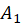
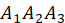
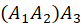
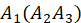
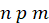
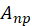
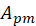
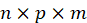

# 1. 算法复杂性分析

## 1.1 函数渐近表达式

课本P2~P4讲的很清楚，有很多数学符号和数学公式推导，这里就不手打了，看书一样的。

总而言之，一共有两种方法：

1. 求出 $T(n)$ 的渐近形态 $\widetilde{T}(n)$，公式如下：

$$
\lim_{n \to \infty} \frac{T(n)-\widetilde{T}(n)}{T(n)} =0
$$

​	然后 $O(n)$ 就等于 $\widetilde{T}(n)$ 去掉常数部分的高阶项。

2. 构造情况当 $n \ge x$ 时，有 $ f(n) \le Cg(n)$，则 $f(n) \le O(g(n))$。

## 1.2 时间复杂度

**快速排序：**

快速排序是从大往小排，每一层都将左右两半的序列各自排好序，然后进入下一层如此往复，最后会因为整个序列只有一个元素而返回，因为一个元素不需要排序，所以此时也说明整个序列都排好序了。因为从大到小排嘛，最小的部分（子序列）都排好了，说明整个待排序序列都排好序了。

```c++
#include <iostream>
using namespace std;

const int N = 100010;

int n;
int q[N];

void quick_sort(int q[], int l, int r)
{
    if (l >= r) return; // 左边界等于右边界则说明此时只有一个数了，不需要排序；如果左边界大于右边界，更应该停止了，因为这种情况不可能发生。
    int x = q[l + r >> 1], i = l - 1, j = r + 1; // x是哨兵，最好取中间，i和j分别是指针，用来交换两个元素以完成排序
    while (i < j) // 两个指针之间起码有两个不同的元素，这样才能交换，左右交换
    {
        while (q[++i] < x); // 因为是从小到大排序，所以最终的序列要满足哨兵左边小于等于哨兵，哨兵右边大于等于哨兵
        while (q[--j] > x); // 所以只有左边大于哨兵和右边小于哨兵的情况才需要交换
        if (i < j) swap(q[i], q[j]); // 这里还需要再判断此指针之间是否起码有两个元素，因为经过两个while循环，i和j可能变的不满足了
    }
    quick_sort(q, l, j); // 递归处理左右子序列，因为每一层都会将左右两部分序列排好序，所以最后只有一个元素而退出时，就说明整个序列都排好序了
    quick_sort(q, j + 1, r);
}

int main()
{
    cin >> n;
    for (int i = 0; i < n; i++) cin >> q[i];
    
    quick_sort(q, 0, n - 1); // 对下标为0到下标为n-1之间的数排序
    
    for (int i = 0; i < n; i++) cout << q[i] << ' ';
    
    return 0;
}
```

最好情况下的时间复杂度为 $O(nlogn)$，因为最好情况下每次都选中间的数作为哨兵，这样一直分下去就是要分 $logn$ 次，然后每个部分都要进行 $n$ 次的排序，因为虽然每一个部分没有 $n$ 个数，但是实际上每一层中所有元素都在各自的部分进行了排序，一共是 $n$ 次排序，所以最好情况下时间复杂度为 $O(nlogn)$。

最坏情况下的时间复杂度为 $O(n^2)$，因为最坏情况下每次都选边界的数作为哨兵，这样一直分下去就要分 $n$ 次，因为每次分都只分了一个数出去，一共 $n$ 个数就要分 $n$ 次。然后每一层还是要进行 $n$ 次排序，所以最坏情况下的时间复杂度会退化为 $O(n^2)$。

平均情况下的时间复杂度为 $O(nlogn)$。证明就算了，这是基于概率算出的结果。


还有一种证明方法是通过时间复杂性函数证明。

最好情况下每次所取的哨兵都是中间的数，则时间复杂性函数 $T(n)$ 为：
$$
T(n)=\left\{\begin{matrix} 
  O(1)  && {n\le1} \\  
  2T(n/2)+O(n) && {n > 1}
\end{matrix}\right.
$$
求解该递归方程，再由时间渐近表达式的知识可得 $T(n)=O(nlogn)$。


最坏情况下每次所取的哨兵都是最边缘的数，将产生的两个区域分别包含 $n-1$ 和 $1$ 个元素，则时间复杂性函数 $T(n)$ 为：
$$
T(n)=\left\{\begin{matrix} 
  O(1)  && {n\le1} \\  
  T(n-1)+O(n) && {n > 1}
\end{matrix}\right.
$$
求解该递归方程，再由时间渐近表达式的知识可得 $T(n)=O(n^2)$。


再提一嘴空间复杂度。快速排序是一种原地排序算法，辅助空间复杂度为 $O(1)$，但是它的递归，会使用系统的栈，而且递归深度在 $logn$ 到 $n$ 之间，所以空间复杂度不确定，在 $O(logn)$ 到 $O(n)$ 之间。


**归并排序：**

归并排序是从小往大排，和快速排序完全相反，一开局的就左右一直递归二分直至将每个部分的数组的元素都变为1个，然后再排序、归并。因为只有一个元素时，排序就是直接比较这两个元素的大小了，小的放进临时数组，大的放后面，这样临时数组就已经是有序的了，然后再覆盖原数组，接着回到倒数第二层，且该部分已经排好了序。如此往复，上面每一层都借助已经排好了序的子序列部分数组而完成排序，一直返回到上面，直到返回到第一层完成排序+归并的步骤后，整个序列就都排好了序。

```c++
#include <iostream>
using namespace std;

const int N = 100010;

int n;
int q[N], tmp[N];

void merge_sort(int q[], int l, int r)
{
    if (l >= r) return; // 左右边界之间只有一个数则不需要排序，左边界大于右边界是不可能的情况，直接退出
    
    int mid = l + r >> 1; // 从中间分割为两部分
    merge_sort(q, l, mid); // 再对左右两部分分别递归分割，直至分到每个小部分都只有一个元素为止
    merge_sort(q, mid + 1, r);
    
    int i = l, j = mid + 1, k = 0; // 然后从每个部分都只有一个元素开始排序，然后将排好序的数组覆盖原数组（归并的过程），故要借助中间数组
    while (i <= mid && j <= r) // 两个部分都没到边界，则按从小到大排序，将各自小的数放到tmp数组中
    {
        if (q[i] <= q[j]) tmp[k++] = q[i++];
        else tmp[k++] = q[j++];
    }
    
    while (i <= mid) tmp[k++] = q[i++]; // 收尾，左右部分可能不一样长。因为归并是从1个元素的部分开始的，所以到这里的时候两个部分各自都是从小到大有序排列的，所以剩余的部分一定是最大的，直接按顺序放到tmp后面就行
    while (j <= r) tmp[k++] = q[j++];
    
    for (int i = l, k = 0; i <= r; i++, k++) q[i] = tmp[k]; // 归并，将排序好的临时数组覆盖原数组，这样这部分就是有序的了，再返回上一层继续排序+归并，这样第一层结束后整个数组就都排好序了
}

int main()
{
    cin >> n;
    for (int i = 0; i < n; i++) cin >> q[i];
    
    merge_sort(q, 0, n - 1); // 对元素下标为0到n-1的数进行归并排序
    
    for (int i = 0; i < n; i++) cout << q[i] << ' ';
    
    return 0;
}
```

对于归并排序，由于算法策略就是确定地将数组分成大致相同的两部分，所以实际上没有最好、最坏和平均的情况，都是同一种情况，即尽量将序列分为相等的两部分。这种划分方式一共会划分 $logn$ 次，每次排序和合并的时间开销是 $O(n)$，于是时间复杂度均为 $O(nlogn)$。

方法二也是通过时间复杂性函数证明。归并排序的时间复杂性函数为：
$$
T(n)=\left\{\begin{matrix} 
  O(1)  && {n\le1} \\  
  2T(n/2)+O(n) && {n > 1}
\end{matrix}\right.
$$
求解该递归方程，再由时间渐近表达式的知识可得 $T(n)=O(nlogn)$。


其空间复杂度为 $O(n)$，因为辅助数组的容量为 $n$。它的递归过程也使用了系统栈，但是由于最大只用了 $O(logn)$，所以整体空间复杂度还是 $O(n)$。

## 1.3 时间复杂性函数

此处指的一般是递归中的递归函数，即 $T(n)$，而且我们一般情况下求出 $T(n)$ 后还需要其推出其时间复杂度 $O(n)$，不过这一步会很简单，因为前面推导的结果就已经是时间复杂度了。

有两种方法求解 $T(n)$，分别是递推（递归树）法和主定理法。


**主定理公式：**

在算法分析中，**主定理**（Master Theorem）为解决递归关系提供了一种通用方法。它特别适用于分析分治法算法的时间复杂度。

主定理处理以下形式的递归关系：
$$
T(n) = aT\left(\frac{n}{b}\right) + f(n)
$$
其中：

- $ a \geq 1  $是子问题的数量
- $b > 1 $ 是每个子问题的规模缩减因子
- $ f(n) $ 是额外的合并或组合操作的代价

主定理的三种情况：

1. **如果** $ f(n) = O(n^c) $ **且** $ c < \log_b a $，那么
   $$
   T(n) = \Theta\left(n^{\log_b a}\right)
   $$

2. **如果** $ f(n) = \Theta\left(n^{\log_b a}\right) $，那么
   $$
   T(n) = \Theta\left(n^{\log_b a} \log n\right)
   $$

3. **如果** $ f(n) = \Omega\left(n^c\right) $ **且**  $ c > \log_b a $ 并且满足正则性条件 $ a f\left(\frac{n}{b}\right) \leq k f(n) $ 对某个常数 \( k < 1 \)，那么
   $$
   T(n) = \Theta(f(n))
   $$


# 2. 二分与分治

## 2.1 二分

二分搜索（Binary Search）是一种在有序数组或列表中快速查找目标元素的位置的高效算法。其基本思想是通过逐步缩小搜索范围，将待查找元素的数量减少一半，从而显著提高查找效率。

基本思想：

1. **排序前提**：二分搜索要求数组或列表是有序的（通常是从小到大排序）。

2. **确定中点**：在每次查找时，将搜索范围的中间元素与目标元素进行比较。

3. **缩小范围：**

   - 如果目标元素等于中间元素，则查找成功，返回中间元素的位置。

   - 如果目标元素小于中间元素，则在中间元素左侧的子数组中继续查找。
   - 如果目标元素大于中间元素，则在中间元素右侧的子数组中继续查找。

4. **递归或迭代**：不断将搜索范围缩小一半，直到找到目标元素或搜索范围为空。

二分搜索的时间复杂度为 O(log⁡n)O(\log n)O(logn)，其中 nnn 是数组的元素个数。由于每次查找都会将搜索范围缩小一半，因此查找效率非常高，特别适合处理大型有序数据集。


代码模板（注意这里的q是递增排列的）：

```c++
	int l = 0, r = n - 1;
	while (l <= r) // 注意，多了个判断相等的分支后就会把所有可能的数（即二分出来的数）都判断一遍，所以最后一个数也会被判断，所以这里l可以等于r表示最后一个数，然后进入判断，如果确实是x就返回下标，如果不是就说明序列中没有x，就一定会出去并返回-1。
	{
		int mid = l + r >> 1;
		if (q[mid] == x) return mid; // 找到了就返回下标。
		else if (q[mid] > x) r = mid - 1;
		else l = mid + 1;
	}
	return -1; // 找不到就返回-1。
```


下面的是acwing的写法，也就是yxc的写法。上面的课本上的是加了优化的，多一个分支用于判断当前是否相等，是的话直接退出，而不是像下面的代码一样会一直收缩到一个数，可以省点时间。而且二分是分为整数二分和浮点数二分的，只不过课本上只讲了整数二分，所以下面也只给出acwing 的整数二分，不过浮点数二分不是一般的简单，一直无脑二分就行，一点情况都不用考虑。

```c++
/*整数二分有两种方式：条件满足时令r=mid,l=mid+1,mid=l+r>>1 和l=mid,r=mid-1,mid=l+r+1>>1*/
/*整数二分最终一定是l=r=满足条件的边界值，所以最终的结果是写l还是r都一样*/

int q[1000010];
bool check(int mid){
	/*此处为判断条件*/
}


/*下列是第一种情况：r=mid,l=mid+1,mid=l+r>>1*/

int bsearch(int l, int r)
{
	while (l < r) {
		int mid = l + r >> 1;
		if (check(mid)) r = mid;
		else l = mid + 1;
	}
	return l;
}

/*下列是第二种情况：l=mid,r=mid-1,mid=l+r+1>>1*/
int bsearch(int l,int r)
{
	while (l < r) {
		int mid = l + r + 1 >> 1;
		if (check(mid)) l = mid;
		else r = mid - 1;
	}
	return l;
}

/*在写题时完全没必要额外写一个函数，直接在主函数里写就行了，因为代码就那么短，额外写个函数只会
增加工作量，这里写只是因为要分开来，更美观直观罢了。而且if的条件直接在括号里写，这里只是为了说
明此处要判断罢了，因为二分需要看具体的题目，所以这里不能直接写完整的代码，只能写下主要的步骤。*/
```

口诀：男左女右（判断为true时） 男是1所以加一，而女是0所以不用加。所以l=mid时要加1，因为l是左，男左女友，左是男，男是1女是0，所以l=mid要加1。

实际上l=mid要加1是为了防止死循环。有这样一个情景，l=r-1，也就是左右边界相邻，中间没有数了，此时如果条件满足则会令l=mid，而mid=l+r>>1的话就等于r-1+r>>1，也就是r-0.5，向下取整后就是r-1，所以此时mid=r-1，然后l=mid，也就是l=r-1，那么就一直不变了，l永远会小于r，进入死循环。此时就要设置为mid=l+r+1，这样l=mid时就是r-1+r+1>>1等于r，然后r<r不满足要求，就退出循环了，成功避免了死循环。

此外，这里还有个性质就是，如果令r=mid，那么不满足时就一定是l=mid+1，如果令l=mid，那么不满足时就一定是r=mid-1。为什么呢，因为mid一定是夹在l和r之间的，而且更新的目的是缩小这个区间，注意一定会缩小，不然最后也不会跳出循环了。如果条件满足时令r=mid，那么想要缩短区间，不满足时就一定要令l=mid+1，左边界不断往右走才会缩短，同理若令l=mid，那么不满足时就要令r=mid-1，只有右边界不断向左走才会缩短区间。

## 2.2 分治

分治法（Divide and Conquer）是一种算法设计策略，它将一个复杂的问题分成若干个规模较小且结构与原问题相似的子问题，递归地求解这些子问题，然后将各个子问题的解合并成原问题的解。

分治法的核心思想是 **“分而治之”**，具体步骤包括：
1. **分解（Divide）**：将原问题划分成若干个子问题，这些子问题通常是规模较小且性质与原问题相似的子问题。
2. **解决（Conquer）**：递归地解决这些子问题。当子问题的规模足够小，直接求解即可。
3. **合并（Combine）**：将子问题的解合并，得到原问题的解。

特点：

- 分治法适用于可以将问题分解为相互独立且具有相同结构的子问题的场景。
- 通常以递归的形式实现，效率较高。
- 时间复杂度的分析常使用**递归树**或**主定理**。

常见应用：

- **归并排序（Merge Sort）**：将数组分成两个子数组，递归排序，然后合并有序子数组。
- **快速排序（Quick Sort）**：通过分区将数组分成两个子数组，递归排序子数组。
- **最大子序列和问题**：将数组分成左右两部分，递归求解，再合并结果。
- **二分搜索（Binary Search）**：通过不断将问题规模减半来实现高效查找。

优点：

- 通过将问题分解为更小的问题，可以降低问题的复杂度，提高算法效率。
- 在并行计算中，分治法能够有效分配任务，提升性能。

缺点：

- 递归实现可能导致较大的空间开销，特别是当递归深度很大时。
- 如果子问题不是独立的，分治法可能会有较大的重复计算。

示例，**归并排序**的分治法过程：

1. **分解**：将数组分成两半，递归地分解直到每个子数组只有一个元素。
2. **解决**：排序每个子数组。
3. **合并**：将两个有序子数组合并成一个有序数组。


**循环赛日程表：**

由于题目约定队伍数只会是偶数次幂，所以我们可以每次都将队伍分成四份，再将分开后的各个队伍块再进行细分，同样是分成四份，如此下去，最后就可以分成只有1个选手。此时就不需要再分了，再结合初始值，从小到大依次将左上、右上的队伍安排各自复制到右下和左下的部分，直至填完整个循环日程表。

具体来说，n表示参赛的队伍数量，也对应矩阵的大小，即有 n 支队伍进行比赛。a用于存储比赛日程的二维数组。最大可以支持 100 支队伍。getResult函数用于递归填充矩阵 a，生成循环赛的日程表。其中，ti 和 tj表示矩阵当前操作的起始位置（左上角位置的行和列）。num表示当前处理的矩阵块的大小。当 num 等于 1 时，不需要再递归，直接返回。因为当矩阵规模为 1 时，已不再需要分割处理。其他情况下，将当前的矩阵块一分为四，每个新矩阵块的大小变为原来的一半。再分别对左上、右上、左下、右下的四个子矩阵递归处理。然后的两段循环用于填充右下角和左下角的矩阵部分。主函数输入相关数据后，将a数组的第一行赋值为运动员1与其他运动员的比赛安排，之后调用递归函数后输出结果即可。

```c++
#include <iostream>
using namespace std;
 
int n;
int a[100][100];
 
void getResult(int ti, int tj, int num)
{
    if (num == 1) return;
 
    int s = num / 2;
    getResult(ti, tj, s);      // 左上角
    getResult(ti, tj + s, s);  // 右上角
    getResult(ti + s, tj, s);  // 左下角
    getResult(ti + s, tj + s, s);  // 右下角
 
    // 填充左上角到右下角
    for (int i = 0; i < s; i++) {
        for (int j = 0; j < s; j++) {
            a[ti + s + i][tj + s + j]=a[ti + i][tj + j];
        }
    }
 
    // 填充右上角到左下角
    for (int i = 0; i < s; i++) {
        for (int j = 0; j < s; j++) {
            a[ti + s + i][tj + j]=a[ti + i][tj + s + j];
        }
    }
}
 
int main()
{
	cin >> n;
 
    for (int i = 1; i <= n; i++) {
        a[0][i - 1] = i;
    }
 
    getResult(0, 0, n);
 
    cout << "循环赛日程表如下：" << endl;
    for (int i = 0; i < n; i++) {
        for (int j = 0; j < n; j++) {
            cout << a[i][j] << "\t";
        }
        cout << endl;
    }
 
    return 0;
}
```

## 2.3 二分+分治综合运用

对{15，9，115，118，3，90，27，25，5}采用归并排序进行使其成为递减序列，然后再从排好序的序列中使用二分查找找出元素z。

```c++
#include <iostream>
using namespace std;

const int N = 100010;

int n, x;
int q[N], tmp[N];

void merge_sort(int q[], int l, int r)
{
	if (l >= r) return;
	
	int mid = l + r >> 1;
	merge_sort(q, l, mid);
	merge_sort(q, mid + 1, r);
	
	int i = l, j = mid + 1, k = 0;
	while (i <= mid && j <= r)
	{
		if (q[i] >= q[j]) tmp[k++] = q[i++];
		else tmp[k++] = q[j++];
	}
	while (i <= mid) tmp[k++] = q[i++];
	while (j <= r) tmp[k++] = q[j++];
	
	for (int i = l, k = 0; i <= r; i++, k++) q[i] = tmp[k];
}

// 该函数实际上是找某个边界值，即上下界，而不是真的在搜索某个特定的数据，找数的功能实际上是顺带的，仔细理解函数的逻辑就知道了。
int binary_search_acwing(int q[], int l, int r)
{
	while (l < r) // 注意，这里是l<r，不能等于，不然会无限循环。
	{
		int mid = l + r + 1 >> 1; // l=mid，男左女右，男1女0，所以要加1，不然会无限循环。
		if (q[mid] >= x) l = mid; // 返回第一个大于等于x的数的下标，指这里的代码。如果写的条件是if (q[mid] <= x)，那么返回的是第一个小于等于x的下标。但是不能死记硬背，要理解代码的逻辑后进行判断。在这里，每次当 q[mid] >= x 时，我们都把左边界移动到 mid，继续在右半部分（值更小的部分）查找，试图找到更靠右、但仍然大于等于 x 的元素，所以找的就是第一个大于等于x的数据，故如果x在序列中就找到x的下标，如果没有，那就找到第一个大于x 的数的下标。
		else r = mid - 1; 
	}
	return l; // 这里l和r都是一样的，因为退出循环的条件就是l=r。
}

// 这才是真正地在找某个特定的数，完全没有别的作用。
int binary_search_textbook(int q[], int l, int r)
{
	while (l <= r) // 注意，多了个判断相等的分支后就会把所有可能的数（即二分出来的数）都判断一遍，所以最后一个数也会被判断，所以这里l可以等于r表示最后一个数，然后进入判断，如果确实是x就返回下标，如果不是就说明序列中没有x，就一定会出去并返回-1。
	{
		int mid = l + r >> 1;
		if (q[mid] == x) return mid; // 找到了就返回下标。
		else if (q[mid] > x) l = mid + 1;
		else r = mid - 1;
	}
	return -1; // 找不到就返回-1。
}

int main()
{
	cin >> n >> x;
	for (int i = 0; i < n; i++) cin >> q[i];
	
	merge_sort(q, 0, n - 1);
	
	for (int i = 0; i < n; i++) cout << q[i] << ' ';
	
	cout << endl;
	int res_acwing = binary_search_acwing(q, 0, n - 1);
	int res_textbook = binary_search_textbook(q, 0, n - 1);
	cout << "acwing: " << res_acwing << endl;
	cout << "textbook: " << res_textbook << endl;
	
	return 0;
}
```

# 3. 动态规划

动态规划（Dynamic Programming, DP）是一种求解优化问题的算法设计策略，适用于那些可以通过分解为子问题并利用子问题的解来构建原问题解的问题。动态规划本质上是分治法的改进，它通过保存子问题的解，避免重复计算，从而提高效率。

其核心思想是将一个复杂问题分解为更小的子问题，解决每个子问题一次，并将它们的解保存，以便下次遇到相同的子问题时可以直接使用已保存的解，而不必重新计算。


关键特性：

1. **最优子结构（Optimal Substructure）**：问题的最优解可以通过子问题的最优解来构造。如果一个问题可以分解为子问题，并且子问题的解可以组合成问题的解，那么就具有最优子结构。
2. **重叠子问题（Overlapping Subproblems）**：不同的子问题会在求解过程中重复出现。动态规划通过保存子问题的解来避免重复计算。


动态规划算法基本步骤：

1. 找出最优解的性质，并刻划其结构特征。

2. 递归地定义最优值。

3. 以自底向上的方式计算出最优值。

4. 根据计算最优值时得到的信息，构造最优解


动态规划通常有两种实现方式：

1. **自顶向下（Top-Down，备忘录法）**：通过递归的方式解决问题，同时使用一个备忘录（记忆化数组）来保存子问题的解，以便在遇到相同的子问题时直接返回结果。
2. **自底向上（Bottom-Up，迭代法）**：通过迭代的方式，从最小的子问题开始逐步求解，并将解存储在表格中，最终得到原问题的解。实际上就是平时说的“动态规划法”。

## 3.1 01背包

PS：最好看一下实验报告，上面也挺详细的，而且主要是有标准解题步骤。

我们用dp[i][j]表示在j容量的背包中，在前i个物品的情况下能找出的最大价值的存放方法。然后对于遍历每个物品，遍历过程中i既表示当前正在考虑的物品编号，又表示了目前可用的物品序列是多少（1~i），对于每个物品及此时可用的物品序列，考虑每种可能容量下的背包，全部计算出最大价值然后存入dp数组中以供后面的情况使用（因为i遍历到后面时，此时的物品序列也包含在后面的物品序列中，因为随着遍历，物品序列是逐渐变长的，直到完全包含所有的物品）。对于其中的某种情况，看看此时的背包容量能否装下物品i，这是为了在有限的容量中尽可能地让总价值最大，所以此时是在分配空间，如果把所有容量分给它都不能装下的话，就只能考虑前i-1个物品了，如果能装下，就有两种情况，一种是不装，那么此时的最大价值就是当前容量下前i-1个物品能提供的最大价值，如果装进去，则背包的这部分容量被分配出去了，我们需要计算剩余容量下前i-1个物品所能提供的最大价值，然后再加上放入物品的价值，这两种情况取最大的作为决策的结果。如此往复，前面为后面做铺垫，后面决策时需要前面的数据，就能计算出符合题意的n个物品m容量的背包所能达到的最大价值。

````c++
#include <iostream>
#include <algorithm>
using namespace std;

int n, m;
const int N = 1010;
int v[N], w[N];
int dp[N][N]; // dp[i][j]表示容量为j的背包下，前i个物品能产生的最大价值

int main()
{
    cin >> n >> m;
    for (int i = 1; i <= n; i++) cin >> v[i] >> w[i];
    
    // 因为i为0时，表示不选物品，所以价值为0，而数组的初始值就是0，所以我们可以直接不管它，直接从i等于1开始遍历
    for (int i = 1; i <= n; i++) {
        // j可以从0开始遍历，而且j可以等于m，因为题目就是求i等于n，j等于m的情况。只不过容量为0肯定价值是0，所以也从1开始遍历
        for (int j = 1; j <= m ;j++) {
            // 当此时容量小于i的大小时，装不进第i个物品，所以价值只能是前i-1个物品里的最大价值。
            if (j < v[i]) dp[i][j] = dp[i - 1][j];
            // 能装下后，最大价值则是 当前容量下前i-1个物品里的最大价值 与 剩余容量下前i-1个物品里的最大价值加上第i个物品后的价值 里的更大者，所以直接max函数即可。
            else dp[i][j] = max(dp[i - 1][j], dp[i - 1][j - v[i]] + w[i]);
        }
    }
    
    // 输出题目要求，前n个物品、总容量为m的最大价值。
    cout << dp[n][m];
    
    return 0;
}
````

## 3.2 最长公共子序列

PS：也看一下实验报告，上面很详细，而且有标准解题步骤。

将集合按照两个序列最后的元素是否相等而分成两个部分。

如果两个序列末尾的字符都相等，那么说明此时已经有一个公共字符了，也就是公共序列长度要加一，起码这两个序列的末尾字符是相同的，那么整个最长公共子序列的长度就等于两序列各自前面部分的最长公共子序列再加长最后相等的一个。如果末尾字符不相等，那么最长公共子序列就等于上面序列前面部分的最长公共子序列和下面部分的最长公共子序列中的最大值，因为最后的字符已经不相等了，那么我们要求的最长公共子序列肯定等于上面或下面其中之一的前面部分的最长公共子序列，而且只能是其中之一，不可能两种情况都有。

```c++
 #include <iostream>
 using namespace std;
 
 const int N = 1010;
 
 int n, m;
 char a[N], b[N];
 int dp[N][N]; // 上面第长度为i的序列和下面长度为j的序列中最长公共子序列的长度
 
 int main()
 {
     cin >> n >> m >> a + 1 >> b + 1;
 
     for (int i = 1; i <= n; i++) {
         for (int j = 1; j <= m; j++) {
             if (a[i] == b[j]) dp[i][j] = dp[i - 1][j - 1] + 1;
             else dp[i][j] = max(dp[i - 1][j], dp[i][j - 1]);
         }
     }
     
     cout << dp[n][m];
     
     return 0;
 }
```

## 3.3 矩阵链乘

PS：解析最好看”算法实验报告4“，上面写的非常非常详细。以下内容是从上面摘了一部分，大致说明了思想，报告里才是完整版的。

首先要理解清楚这两个测试用例是什么意思，给出的是行列号，实际上这些数字里蕴含了矩阵的信息，也就是行数和列数，它们就在这串行列号中。这串行列号的前两个数字分别代表矩阵的行数和列数，第二个和第三个数字分别代表矩阵的行数和列数，也就是说，若将这串数字从０开始编号，存放在数组ａ中，表示第个矩阵，从１开始编号，则。按顺序两两组成一个矩阵且前一个矩阵的列数等于后一个矩阵的行数，因为只有保证了这种相等关系才能进行矩阵的乘法。只要按照规则来，这一串矩阵最终可以连续相乘至一个矩阵，并且这个矩阵的行数就等于序列的第一个数字，列数等于序列的最后一个数字。

这些矩阵由于是连乘，所以可以不必要等前两个矩阵乘完了得出新矩阵后，再将其与下一个矩阵相乘，可以不用按原顺序，因为乘法是有结合律的，可以先乘后两个，再把结果和前一个相乘，只需要保证这个矩阵的排列顺序不变，如保持排列顺序不变的基础上，和的结果是一样的。但是总乘法次数是不同的，因为总次数是所有矩阵相乘各自的次数相加，而不同的矩阵相乘次数不会相同。对于序列，可以表示两个矩阵和，这两个矩阵相乘的总次数就等于，这是由矩阵乘法的运算规则得出的。所以对于矩阵链乘法问题，有必要找出一个乘法顺序使得总次数最小，这也就是本题的题意。

```c++
#include <iostream>
using namespace std;

#define INF 0x3f3f3f3f;

const int N = 100;

int n;
int a[N], dp[N][N], res[N][N]; // a存储行列数，dp[i][j]存储Ai...Aj连乘的最小乘法总次数

void getRes(int l, int r)
{
	if (l == r) {
		cout << 'A' << l;
		return;
	}
	cout << '(';
	getRes(l, res[l][r]);
	getRes(res[l][r] + 1, r);
	cout << ')';
}

int main()
{
	cin >> n;
	for (int i = 0; i <= n; i++) cin >> a[i];
	
	for (int len = 2; len <= n; len++) {
		for (int i = 1; i <= n - len + 1; i++) {
			int j = i + len - 1;
			dp[i][j] = INF;
			for (int k = i; k <= j - 1; k++) {
				int t = dp[i][k] + dp[k + 1][j] + a[i - 1] * a[k] * a[j];
				if (t < dp[i][j]) {
					dp[i][j] = t;
					res[i][j] = k;
				}
			}
		}
	}
	
	cout << "最小总乘法次数为：" << dp[1][n] << endl;
	cout << "最优顺序为：";
	getRes(1, n);
	
	return 0;
}
```

# 4. 贪心

贪心算法是一种算法设计范式，用于解决优化问题。其核心思想是在求解问题的过程中，总是做出当前看起来最优的选择，以期在整体上达到最优解。贪心算法在每一步选择中都只关注局部的最优解，并不考虑全局的整体情况或对将来的步骤做出预测。

贪心算法并不总能保证找到全局最优解，特别是在一些复杂问题中，可能无法找到正确的解。这时需要借助其他方法，如动态规划或回溯法。


基本要素：

1. **贪心选择性质 (Greedy Choice Property)**：每一步都做出一个局部最优的选择，不再考虑将来可能的情况，期望通过一系列局部最优的选择得到全局最优解。

2. **最优子结构性质 (Optimal Substructure)**：问题可以通过子问题的最优解构建出整体问题的最优解。这意味着通过将问题分解为若干个子问题，利用子问题的最优解可以解决原问题。

3. **不可回溯性**：贪心算法做出的选择一旦确定，就不能再更改。因此，贪心算法通常不会进行回溯或重新考虑以前的决策。

注意，课本上没有第三条，只有前两条。


贪心算法适用于那些满足“贪心选择性”和“最优子结构”性质的问题。例如：

- 最小生成树（如 Kruskal 和 Prim 算法）
- 最短路径问题（如 Dijkstra 算法）
- 活动选择问题
- 背包问题（贪心算法只能求解部分特殊的背包问题，如分数背包问题）

## 4.1 活动安排

例题：[acwing 4167.活动安排](https://www.acwing.com/problem/content/4170/)

题目和书上几乎一样，只不过要求输出的是互相兼容的最大活动个数，核心代码都一样的。

主要思想就是每一步都贪心选择，尽可能选最多的活动。因为安排活动必须有一个前提，那就是这个活动必须得等上一个活动结束了才能开始，所以我们可以直接对活动结束时间进行排序，只要活动结束的早那就更有可能安排更多的活动，所以只要后面的活动开始时间大于等于目前活动的结束时间那就安排，而且由于所有活动都是按照结束时间排序的，所以第一个遍历到的满足条件的活动的结束时间一定是它后面活动最早结束的，给后面活动开始省了最多时间。每一步都这样选，所以最后的结果一定是最优的。

```c++
#include <iostream>
#include <algorithm>
using namespace std;

typedef pair<int, int> PII;

const int N = 1010;

int n;
PII a[N];

bool cmp(PII a, PII b)
{
    return a.second < b.second;
}

int main()
{
    cin >> n;
    for (int i = 1; i <= n; i++) cin >> a[i].first >> a[i].second;
    
    sort(a, a + n, cmp);
    
    int cnt = 1;
    for (int i = 2, j = 1; i <= n; i++) { // i是目前要对比的活动编号，j是目前正在举办的活动编号（或者说已选择的活动编号）
        if (a[i].first >= a[j].second) { // 活动的开始时间大于等于当前活动的结束时间，可以安排
            j = i; // 让该活动作为目前举办的活动
            cnt++;
        }
    }
    
    cout << cnt;
    
    return 0;
}
```

## 4.2 哈夫曼编码

PS：这个也是实验里的，原版为”算法实验报告6“，不过这里把所有分析都复制粘贴过来了，挺全的，可以直接看这个。而且考试不可能考完整代码，因为太难了，考怎么画Huffman树还差不多，怎么可能自己写完整代码。下列代码了解即可，做到心中有数。

Huffman编码是一种用于数据压缩的贪心算法，主要目的是通过字符的频率来生成最优的编码方式，使得高频字符编码较短、低频字符编码较长，从而达到压缩效果。算法的关键在于构建一棵哈夫曼树，在这棵树中：每个字符是树的一个叶子节点；左右分支分别代表编码“0”和“1”。

于是使用一个结构体Node表示Huffman树的节点，每个节点均包含字符本身、字符的频率以及分别指向左右子节点的节点指针，因为后面需要输出Huffman编码，需要根据左右孩子节点而确定编码为0还是1。接着采用小根堆构建Huffman树，因为构建树时，每次都需要从还未合并的节点中找到频率最小的两个节点，将其合并成一个新的节点并插回队列，直到只剩下一个根节点为止，而小根堆的特点就是根节点始终最小，于是让小根堆始终提供当前最小频率的节点。在构建Huffman树的过程中，每次都从小根堆中取出频率最小的两个节点left和right，然后创建一个新节点p，其频率等于left和right的频率之和，且其左节点指向left，右节点指向right，最后将p插入堆中。不断循环此过程，直至最后还剩一个节点，且这个节点就是Huffman树的根节点。

最后回溯Huffman树输出编码，从Huffman树的根节点出发，通过递归访问每个节点。如果向左子树递归，编码添加“0”；如果向右子树递归，编码添加“1”。当递归到叶子节点时，已经形成了该字符的完整编码，将字符和编码输出。整个递归过程会遍历整棵树，逐一输出每个字符的编码。

```c++
#include <iostream>
#include <queue>
#include <vector>
using namespace std;

const int N = 100;

int a[N];
string s;

// 定义哈夫曼树的节点结构
typedef struct Node {
    char c;  // 字符
    int num;   // 频率
    Node *left, *right;
} Node;

// 比较器用于优先队列
struct Compare {
    bool operator()(Node *a, Node *b) {
        return a->num > b->num;
    }
};

// 回溯输出哈夫曼编码
void printResult(Node *p, string code)
{
    if (!p) return;

    // 如果节点是叶子节点，输出字符及其编码
    if (!p->left && !p->right) {
        cout << p->c << '\t' << code << endl;
        return;
    }

    // 递归左子树和右子树，分别添加 '0' 和 '1'
    printResult(p->left, code + "0");
    printResult(p->right, code + "1");
}

int main()
{
    // 给定的字符及其频率
    cin >> s;
    for (int i = 0; i < s.size(); i++) cin >> a[i];
    
    // 创建小根堆
    priority_queue<Node*, vector<Node*>, Compare> heap;
    
    // 构建初始的叶子节点并加入堆
    for (int i = 0; i < s.size(); i++) {
    	Node *p = new Node;
    	p->c = s[i];
    	p->num = a[i];
    	p->left = nullptr;
        p->right = nullptr;
        heap.push(p);
    }
    
    // 构建哈夫曼树
    while (heap.size() > 1)
    {
        // 取出频率最小的两个节点
        Node *left = heap.top(); heap.pop();
        Node *right = heap.top(); heap.pop();
        
        // 创建新节点，频率为两节点之和
        int sum = left->num + right->num;
        Node *p = new Node;
        p->c = '\0';
    	p->num = sum;
        p->left = left;
        p->right = right;

        // 新节点插回堆
        heap.push(p);
    }
	
	Node *p = heap.top();

    // 输出每个字符的哈夫曼编码
    cout << "Huffman编码如下：" << endl;
    printResult(p, "");

    return 0;
}
```

## 4.3 贪心与背包

**为什么说01背包不能用贪心算法做，而普通背包又可以用贪心算法做？**

因为01背包的物品不可以分开来，只能选或不选，而普通背包可以分开来，也就是说普通背包可以放入分数个的物品。而对于01背包如果也计算性价比的话，很可能会因为优先放入的物品最后并不在最高价值物品的集合中，因为01背包要全局最优，达到最优的过程需要有子问题也最优，但是采用贪心的算法就真的只满足局部最优而不满足全局最优了。但普通背包没问题，就是因为普通背包的物品可以拆分为分数个，所以不必担心我选了目前性价比最高的，那剩余容量怎么办？因为可以拆开来然后填满，只不过01背包就要考虑了，所以01背包不能用贪心做。但是不代表01背包只能用动态规划做，只能说动态规划只是最适合的方法，也可以采用回溯法和分支限界法求解，反正不能用贪心做。

说了这么多，核心原因就是，**贪心算法无法保证最终能将背包装满，部分闲置的背包空间使每千克背包空间的价值降低了**。在考虑-1背包问题时，应比较选择该物品和不选择该物品所导致的最终方案，再做出最好选择。


**怎么用贪心算法求解普通背包？**注意，普通背包就是把物品看作蛋糕，可以取0~1的任意值，也就是说可以取分数个物品，但是最多只有1个。

贪心算法是求局部最优，不在乎是否为全局最优。所以对于有限容量的背包，我们想装下最大价值的物品，就应该尽可能让装进去的物品性价比尽可能地高，这里的性价比表达式如下：
$$
性价比=\frac{代价}{价值}
$$
其中，“性”指代价，即每个物品所占的空间或者说重量，“价”指价值，即每个物品的价值，故“性价比”在此处指单位空间（重量）的价值。

只要我们每次都装入所有物品中单位价值最高的物品，那么整个背包的总价值一定是最高的。所以求解方法为：

1. 计算所有物品的性价比，即单位空间价值；
2. 在目前背包容量能放下整个物品的情况下，优先放入整个性价比最高的物品，如此循环直至背包不能再放下完整的物品；
3. 计算剩余空间，然后对于全放入目前剩下物品中性价比最高的物品，放入该物品的数量的计算公式为：

$$
数量=\frac{背包剩余容量}{该物品的代价} 
$$

也就是说，放入多少该物品可以刚好填充满背包，可以说次数算出来的几乎都是分数，因为基本上到这一步时背包已经没有足够的容量放下完整的物品了。

例题请看学习通作业5的第一题。

# 5. 回溯法与分支限界法

## 5.1 回溯法

实际上就是dfs+剪枝，递归所有可能的情况，遇到已经不可能的情况时直接return（即剪枝），大部分都和全排列、n皇后类似。

回溯法的核心是递归和状态空间树的构建及遍历。采用“试探、判断、回退”的策略进行探索。通过在尝试每种可能的选择后继续往下推演，当条件不满足时回溯到上一步并尝试其他选择。


**解空间：**

解空间常常组织成树的形式，实际上就是把所有的情况以递归树的形式画出来，所以解空间也常被称为“解空间树”。解空间树的第i层到第i+1层边上的标号给出了变量的值，从根节点到叶节点的任一路径表示解空间中的一个元素。注意，路径或者说边才是代表各种情况，结点实际上代表的是此时的状态。比如01背包的解空间树，结点代表此时背包的状态（容量、价值），路径表示某个物品选或不选，第一层到第二层结点之间的边有两个分叉，左1右0，含义是第1个物品选或不选。TSP问题也同理，边代表某个城市，即周游路线上的城市，不过结点没什么含义。

解空间树常常按照问题的不同分为两种：子集树与排列树。当所给的问题是从n个元素的集合S中找出满足某种性质的子集时，相应的解空间树称为“子集树”，这类子集树通常有 $2^n$ 个叶节点，结点总个数为 $2^{n+1}-1$ 个，遍历子集树的任何算法均需 $Ω(2^n)$ 的计算时间，因为每个元素都能选与不选；当所给的问题是确定n个元素满足某种性质的排列时，相应的解空间树称为“排列树”，这类排列数通常有 $n!$ 个叶节点，遍历排列树需要 $Ω(n!)$ 的计算时间，因为第一条路径有n种选法，第二条有n-1种，以此类推，共有n!种情况。


**解题步骤：**

1. 针对所给问题，定义问题的解空间
2. 确定易于搜索的解空间结构
3. 以深度优先方式搜索解空间，并在搜索过程中用剪枝 函数避免无效搜索


**n-皇后问题：**

n皇后问题是每一行都会有一个皇后，但是这些皇后满足自己所在的同一列、同一左对角线和同一右对角线都有且只有一个皇后。

正因为每一行必定有一个皇后，只是位置不确定，所以我们可以对行进行深度优先遍历。从第0行开始，到第n-1行结束，每一行都找出一个位置放皇后使得满足条件。当递归放置第n行时，就意味着整个棋盘的皇后都放好了（0~n-1），于是输出棋盘并返回。注意递归调用前要保护现场，并在返回后要恢复现场，以便递归别的情况。

关于对角线的下标，在这里采用一维数组存储每条对角线上是否有皇后。

接下来说明递归过程中如何计算某位置的左右对角线。首先明确一下，edg数组表示其中一条对角线，而nedg则表示相对的另一条对角线，并无规定edg一定是主对角线。但是由于编码习惯，实际上我们是令edg作为副对角线，nedg作为主对角线。首先我们要明白一点，我们正在写的是c++代码，而c++的数组是左上角为0，x轴和y轴分别向下向右递增，即右下角为(n, n)。而上面提到的主副对角线则是对于整个正方形棋盘而言，左上到右下为正，右上到左下为负。而每一条对角线上的所有点都有一个共同特点，那就是截距相同。每条线都有斜率和截距，那么同一条线上的点的截距可不就相同嘛。而主副对角线的区别也就是斜率相反罢了，一个是1，一个是-1。也就是说，edg和nedg数组里存的实际上是所有对角线能够达到的截距范围，而其中每一个数值（即每一个对角线）都代表了一条线，只要这个数值为true，就证明这条对角线已经放了皇后。由于正方形的对角线斜率一定是1或-1，所以所有对角线的截距范围是$-N到N$，由于是整数，所以一共有$2N$种取值情况，这也是为什么edg和nedg数值要开$N*2$，因为截距一共最多有2N种情况，每一种情况都要存储具体的截距值，所以要开$N*2$的空间来存放截距。而每个位置怎么算截距则是简单的初中数学问题，如下图所示：


图片中的x就是我们的u，y则是我们的i，实际上主对角线和副对角线的值应该分别为 $i-u$ 和 $i+u$，但是由于数组下标不能为负数，所以必须加上一个常量使得不越界，于是两个下标分别为 $i-u+n$ 和 $i+u$，再由于编码习惯，于是演化（调整运算顺序）为 $u+i$ 和 $n-u+i$。实际编码中，谁写前面都行，没规定一定要edg写 $u+i$，nedg写 $n-u+i$。

```c++
#include <iostream>
using namespace std;

const int N = 11;

int n;
char g[N][N];
bool col[N], edg[N * 2], nedg[N * 2];

// 遍历每一行，从第0行开始，到第n-1行。u代表目前正在放第几行的皇后，正常是从0~n-1，u为n时说明棋盘放满了。
void dfs(int u)
{
    if (u == n) { // 目前遍历第n行，所以超了，要输出
        for (int i = 0; i < n; i++) puts(g[i]);
        puts("");
        return;
    }
    
    for (int i = 0; i < n; i++) { // 遍历每一列，因为每一行必定会放下一个皇后，只是位置不同。所以遍历所有列一定能找到符合条件的位置。
        if (!col[i] && !edg[u + i] && !nedg[n - u + i]) {
            g[u][i] = 'Q';
            col[i] = edg[u + i] = nedg[n - u + i] = true; // 保护现场
            dfs(u + 1);
            col[i] = edg[u + i] = nedg[n - u + i] = false; // 恢复现场
            g[u][i] = '.';
        }
    }
}

int main()
{
    cin >> n;
    
    for (int i = 0; i < n; i++)
        for (int j = 0; j < n; j++) 
            g[i][j] = '.';
    
    dfs(0); // 从第一行开始放皇后，也就是下标为0的行
    
    return 0;
}
```

实际上这是按行枚举的做法，我们也可以采用按元素枚举，也就是枚举棋盘（二维数组）中的每一个位置，到底是放皇后还是不放皇后（取值为`.`还是`Q`）。双重循环遍历棋盘，递归每个位置每种情况，此时要加上row数组，因为要看同一行是否放了皇后。此外，需要引入变量s来记录已经正在放第几个皇后，正常取值还是 0~n-1，所以当s为n时说明棋盘已经放满了。由于这种按元素枚举的方法时间复杂度太高了，达到了惊人的 $O(2^{n^2})$，而按行枚举的方法则是 $O(n!)$，比按元素枚举小了非常多，于是这里就不给出按元素枚举的代码了，没有意义，了解这种思想（方法）即可，具体的代码可以去acwing上看别人的题解。我自己写代码只需要用按行枚举就行了。

## 5.2 分支限界法

分支限界法就是bfs+剪枝，借助队列实现bfs，再与回溯类似，遇到已经不可能的情况时直接return（即剪枝）。


解空间：


## 5.3 回溯法和分支限界法的异同点


## 5.4 01背包用回溯法和分支限界法

**回溯法：**

很容易，和全排列、n皇后没啥两样，就是dfs遍历每条路径，不行就return，期间维护一下最大价值时及对应物品即可。


解空间树：


**分支限界法：**


解空间树：


# 6. 各算法思想的区别

## 6.1 回溯法、递归与分治法三者的区别

​           

## 6.2 回溯法与分支限界法之间的区别


## 6.3 贪心与动态规划的区别


