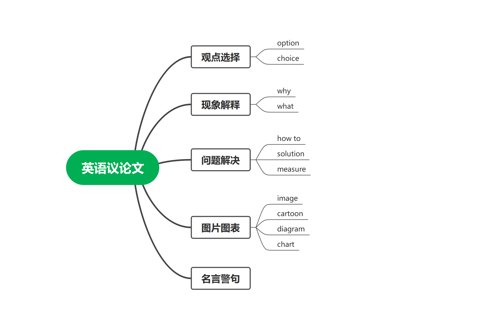

# 一. 概述

英语作文准确来说只有议论文有模板，或者说应用文虽然有但是太笼统了，几乎都要自己写，而且高中时写的作文几乎都是应用文，所以也可以按照高中的写法来写。而议论文不一样，高中写得很少，自己编肯定写的很烂，不可能得高分，这时候就需要模板了。

# 二. 议论文

议论文的标志：**essay**

议论文的四种类型：

所有类型的议论文，只有首段不一样， 二、三段的模板都是一样的，完全通用，可以直接套。

# 三. 结构

英语议论文结构采用**三段式**，共10~11句话。

首段：前1~2句提出你的问题（对问题的看法，好还是不好，应不应该这样做），第3句为过渡句。

中间段：共6个句子  ->  3个论点 + 3个论据。即共有3组，每一组都是：论点+论据

尾段：2句。第1句：重申观点；第2句：万能结尾（提出期望）

# 四. 中间段和结尾段模板

## 1. 中间段模板

First and foremost, there is no doubt that <u>(尽量不出错)</u>. Based on a most recent survey, it is revealed that a majority of successful social elites have admitted (that) ___________________. Furthermore, it is obvious that ___________________. Where there is/are <u>(注意单复数)</u>, there is/are <u>(与前面单复数保持一致)</u>. Last but not least, no one can deny that ___________________. Although ___________________, ___________________.

**这三组句子中，每一组都为：逻辑词+万能句+论据。**

## 2. 结尾段模板

In a word, the whole society should pay close attention to the problem of ___________________. Only in this way can we have a bright and promising future.

注：In a word 后那一句 the whole ...... 也可换成其他句子，尤其是写名言警句的时候。视逻辑而定。

# 五. 各类文章的首段模板

## 1. 现象解释类

关键词：why、what

With the rapid development of <u>(填：society, culture, medical, service, education, economy)</u>, it is of great significance for <u>(填：students, residents, citizens, youngsters)</u> to ___________________. It is quite natural for us to ponder over the question of <u>(填：主题词)</u>.

## 2. 观点选择类

关键词：option、choice

第一句：引出背景

第二句：做出选择

第三句：过渡句

With the rapid development of ___________________, nowadays, <u>(students, youngsters)</u> have different opinions upon graduation. Some think that ___________________ is beneficial, while others think ___________________ is a better choice. From my personal perspective, I prefer the former/latter. The following reasons can account for my preference.

## 3. 问题解决类

关键词：how to、solution、measure

With the rapid globalization(development) of <u>econom (可换成别的)</u>,  <u>speaking ability is becoming increasing crucial (写现象)</u>. It is of great significance for <u>youngsters (可换成别的)</u> to <u>develop their speaking ability (观点)</u>. How to address for this problem? The following solutions can account for this issue.

## 4. 图画图表类

关键词：image、chart、diagram、cartoon

As is starkly reflected in the image/chart, <u>a cruel hunter was holding an ice-cold gun towards an innocent bear (描述图片)</u>. It is revealed that <u>we should protect wild animals</u>. The following reasons can account for this issue.

## 5. 名言警句类

As an old saying goes : <u>Haste makes waste (抄原文)</u>. For us college students, it has an increasingly important significance : <u>If you want to achieve something, you need to take time to do it (用自己的话解释一遍)</u>. The following reasons can account for this issue.

