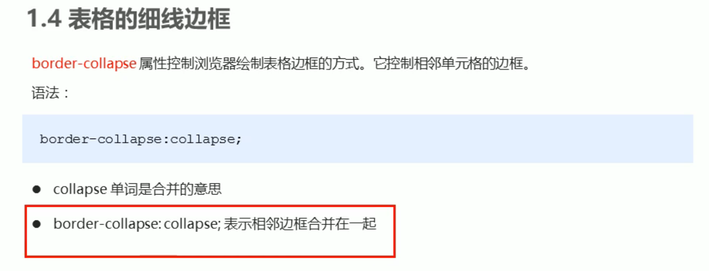

# CSS

## 基础选择器

基础选择器分为四种：标签选择器、类选择器、id选择器和通配符选择器。

1. 标签选择器

顾名思义，就是选择HTML标签的，使用时一次性选择整个页面中的指定标签，不够灵活，较少情况使用。

```css
标签名 {
	属性: 值;
    属性: 值;
    ...
}
```

如：

```css
h1 {
	color: red;
}
```

注意，每写一条属性都要用分号结尾。


2. 类选择器

可以一次性选择多个标签，只要标签设置了相同的类。注意只要用 `.` 开头，后面跟着类名。 开发中最常使用。

```css
.red {
	color: red;
}
```

而且标签中的类可以一次性写多个，这样该标签就会同时拥有那些标签的样式，多个类之间用空格分隔。如：

```css
<div class="red font16"> </div>
```


3. id选择器

id具有唯一性，所以一次只能选择一个标签。使用时要用 `#` 开始，后面跟着 id 名。开发中一般与 js 搭配使用。

```css
#nav {
	color: red;
}
```


4. 通配符选择器

一次性选择整个页面所有的标签，用 `*` 即可，不需要跟别的东西。一般只有特殊情况会使用。

```css
* {
	color: red;
}
```

## 字体属性

字号，`font-size=XXpx`，注意单位是px，即像素。

字体，`font-family`，如果字体名字超过了一个单词则要用单引号括起来，如 `font-family='Microsoft yahei'`。而且可以设置好几个字体，字体之间用逗号隔开就行，执行时会从前往后挨个检查，如果系统有该字体就使用，没有就看下一个有没有，有就用，没有就继续，全都没有就用系统默认字体。而且谷歌浏览器的默认字体就是微软雅黑。

字体粗细，`font-weight`，这里不需要单位，写数字就行。加粗是700，不加粗是400，我们可以把默认加粗的字变得不加粗，比如

```css
h1 {
	font-weight: 400;
}
```

字体样式，`font-style`，用来改变字体状态的，主要是倾斜italic，还可以用normal把倾斜的字变得不倾斜。设置`font-style=normal` 即可，最常用。

字体连写，可以省代码，但是有约束条件：

1. 有顺序，不能随意更换位置，必须遵循下列规范：

```
font: font-style  font-weight  font-size/line-height  font-family
```

2. 字号和字体必须同时出现，也就是说，其他都能省略，但是 font-size 和 font-family 不能省略，而且顺序也不能错。

## 文本属性

文本颜色，常用十六进制，即 `color=#XXXXXX`。

文本对齐，`text-align=center/left/right`。

设文本缩进，`text-indent=Xem`。注意使用相对单位 `em`，这样就可以直接设置要缩进多少个字。比如设置首行缩进2个字，就用 `text-indent=2em`。

文本修饰，`text-decoration`，常用添加下划线 `text-decoration`=underline 和取消下划线 `text-decoration=none`。

行高，`line-height`，本质修改的是文字的上下间距。

## CSS引入方式

按照CSS样式书写的位置（引入的方式），可以分为三大类：

- 行内样式表（行内式）
- 内部样式表（嵌入式）
- 外部样式表（链接式）


1. 内部样式表

写在HTML页面内部（通常写在head中）。将所有的CSS代码抽取出来，单独放到一个 `<style> `标签中。

```css
<style>
    div {
        color: red;
    }
</style>
```

可以控制整个HTML页面的样式。


2. 行内样式表

直接在元素标签内部的 style 属性中设定CSS样式，适合于修改简单样式。

```
<div style="color: red; font-size: 12px;"> </div>
```

要用双引号括起来，并且符合CSS的规范，且只能控制当前标签。


3. 外部样式表

实际开发中都是用外部样式表，适合于样式比较多的情况。其核心是：样式单独写到CSS文件中，之后把CSS样式引入到HTML页面中使用。这样可以控制多个页面，只要引入了。

使用外部样式表有两步：

​    a. 新建外部样式表，如 style.css，这个页面只有CSS样式。

​    b. 在HTML页面中使用 `<link>` 标签引入CSS文件。注意该标签中 rel 部分必须写 stylesheet。

```html
<link rel="stylesheet" href="CSS文件路径">
```

一般在 `</head>` 上方引入外部样式表，如：

```html
<head>
	...
	<link rel="stylesheet" href="style.css">
</head>
```

## 复合选择器


## 显示模式


## 背景图片 


 ## 边框

边框border可以通过 top、bottom、left和 right分 别指定上下左右的边距、颜色和样式等，也可以使用 border 直接简写。


注意，添加边框会改变盒子的大小，也就是说会让盒子变大，所以指定边框后需要考虑盒子的大小，可能得手动减小盒子的大小以使整体不变。


美化表格：

注意，一个表格分为表格框架和单元格，即 `<table>` 、`<th>` 、`<td>` 等样式需要单独指定。而且不指定 `border-collapse: collapse;` 的话边框看起来会很粗，因为这实际上是两个单元格的边框贴在一起了，就相当于边框变成了两倍粗，此时就需要指定这个属性合并一下。



## 内边距

内边距 padding 可以通过 top、bottom、left和 right分 别指定上下左右内边距的大小，也可以使用 padding 直接简写，注意这里分情况讨论，不同情况有不同的意义。


注意，添加内边距和添加边框一样，也会改变盒子的大小，所以也需要考虑盒子的大小，可能得手动减小盒子的大小以使整体不变。


内边距会撑开盒子，我们可以利用这个性质制作漂亮的导航栏等等，我们只需要设置内边距，这样实际上的宽度就会随着内容的长度而自动变化，很好看。所以我们一般都是精确指定 padding 的值，而不是使用文本缩进，因为文本缩进会依赖文本的大小，是个不确定因素。

有一种特殊情况，设置 padding 不会撑开盒子。那就是该块级元素不指定 width/height，因为块级元素的宽度默认是其父级元素的宽度，我们不指定宽度设定 padding，该盒子也不会超出父亲盒子的宽。一旦指定了 width 或 height，那么再设置 padding，盒子的宽或高就会撑开了。

## 外边距

和内边距几乎一样，用法也是。

有一种典型应用是设置块级元素水平居中，只需要令 margin 的左右为 auto即可。


注意，该方法只能让块级元素水平居中，行内元素或行内块元素不行。若要给行内元素或行内块元素设置居中，那么就要给其父元素添加 `text-align: center;`，也就是把这些行内（块）元素当作文本看待，使其水平居中。

 ## 嵌套块元素垂直外边距的塌陷


具体表现为，里面的盒子想要距离外边的盒子一定距离从而设置 `margin-top: xxpx`，但是父亲和孩子作为一个整体一起向下移动了，父亲和孩子的相对距离却不变，这种情况就称为“塌陷”。我们只需要给父亲添加一句话即可：`overflow: hidden;`。

## 清除内外边距


这句神奇的代码一般放在CSS文件的第一句，清除完内外边距后再布局会更好。

注意：行内元素尽量不要设置上下内外边距，只设置左右内外边距。因为行内元素即使设置了上下内外边距也不会生效，看起来都是没有边距。如果一定要设置，那就将其转换为块级元素。
